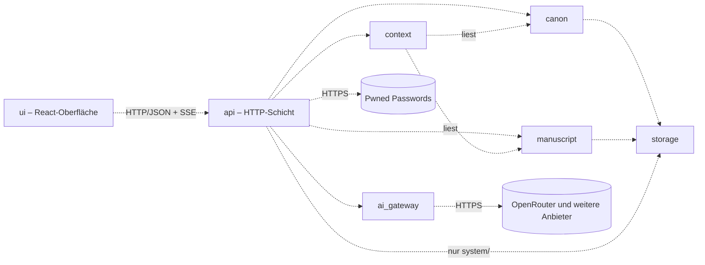
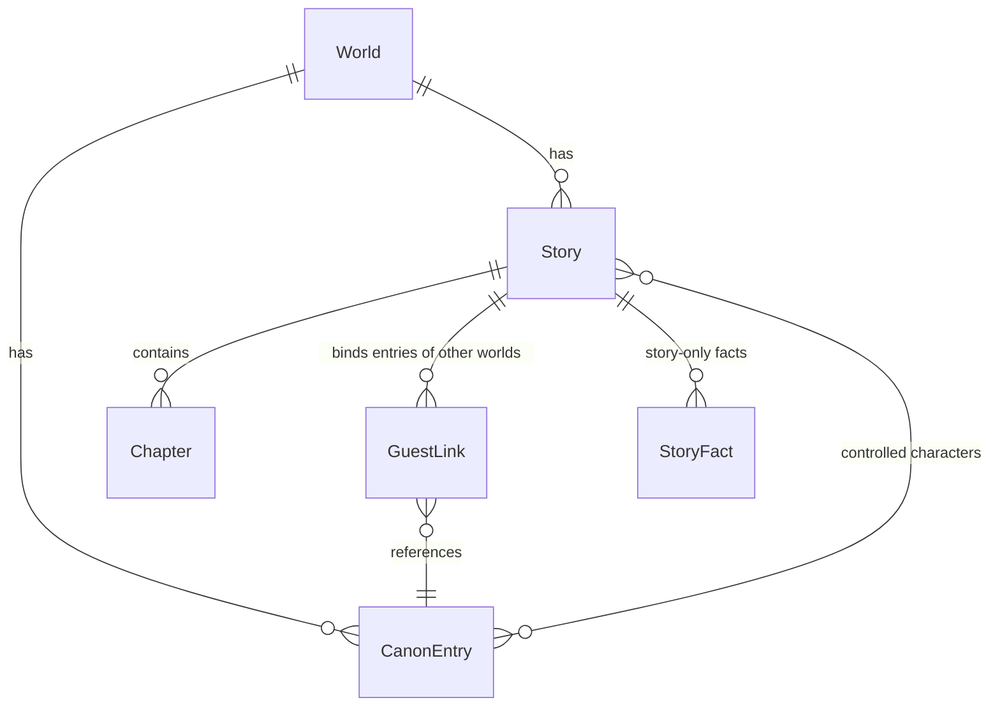

# Architecture – Skriptorium

<!-- Systemarchitektur, Modulgrenzen, Schnittstellenverträge.
     Befüllt in Modus 2 Schritt 4 (templates/projektstart.md Abschnitt 1.3), Klasse M: ein Dokument.
     Jeder Bestandteil trägt einen Reifegrad-Marker. Änderungen an belastbaren Bestandteilen sind
     freigabepflichtig (CLAUDE.md Abschnitt 4). -->

<!-- ANCHOR:reifegrad-system -->
## 0. Reifegrad-System

Jedes Modul, jede Schnittstelle und jede Architektur-Aussage trägt einen der folgenden Marker:

- `[BELASTBAR]` – Entscheidung getroffen, durch Umsetzung validiert oder durch ADR fixiert. Änderung ist freigabepflichtig (CLAUDE.md Abschnitt 4) und erzeugt einen ADR.
- `[VORLÄUFIG]` – Entwurfshypothese, plausibel aber nicht durch Umsetzung validiert. Darf in der Implementierung verfeinert werden, ohne separate Freigabe – jede Verfeinerung wird im Dokument nachgezogen und mit Datum vermerkt.
- `[OFFEN]` – bewusst nicht entschieden. Kein Code in Bereichen, die davon abhängen, bevor die Lücke geschlossen ist.

**Beförderungsregel:** `[VORLÄUFIG]` → `[BELASTBAR]` durch funktionierende Implementierung **oder** ADR; beides mit Datum und Begründung am Eintrag.

**Ausnahme Schutzmechanismen** (Alarme, Überwachung, Backups/Wiederherstellung, Rate-Limits, Release-/Deploy-Gates): Beförderung erst nach einem absichtlich herbeigeführten Fehlerfall, der vollständig durchlief (CLAUDE.md Abschnitt 6).

**Rückstufungsregel:** `[BELASTBAR]` → `[VORLÄUFIG]` oder `[OFFEN]` nur per ADR.

<!-- ANCHOR:ueberblick -->
## 1. Überblick

Das Skriptorium ist eine Web-App für einen einzelnen Autor: ein Python-Server (FastAPI) liefert eine React-Oberfläche mit Markdown-Editor (CodeMirror 6) aus und stellt die Fachfunktionen bereit. Welten, Kanon und Manuskripte liegen als Markdown-Dateien; eine SQLite-Datei dient als jederzeit neu aufbaubarer Suchindex. Prägende Kernentscheidung ist die **Kontext-Zusammenstellung**: Jede KI-Anfrage wird unter einem festen Token-Budget aus Regeln, Kanon-Ausschnitt, verdichtetem Handlungsstand und den letzten Manuskript-Seiten gebaut, statt den ganzen Verlauf mitzuschicken.

**Architektur-Pattern:** Modularer Monolith – eine Betriebseinheit mit fachlich getrennten Modulen `[BELASTBAR]` (ADR-003, Heuristik 1.3: ein Nutzer, ein Betriebsziel, fachliche Komplexität).

**Kommunikations-Grundmodus:** synchron. Oberfläche ↔ Server über HTTP/JSON; KI-Antworten werden per Streaming (Server-Sent Events) Wort für Wort an die Oberfläche weitergereicht. Module im Server rufen einander als Python-Funktionen über ihre öffentlichen Schnittstellen auf. `[BELASTBAR]` (ADR-013; Streaming vom Anbieter mit httpx in 1.3 erprobt)

<!-- ANCHOR:modul-karte -->
## 2. Modul-Karte

Nur die gezeigten Beziehungen sind erlaubt; jede weitere ist ein Architekturbruch. Alle Beziehungen `[BELASTBAR]` seit 2026-09-26 (ADR-013); die Striche der Grafik bleiben aus der Entwurfszeit.



**Leitregeln:** `context` liest nur, schreibt nie. `ai_gateway` kennt keine Fachbegriffe (Welt, Kanon), nur Nachrichten, Modelle und Token. `storage` ist die einzige Stelle, die Dateien und den Index berührt; `api` nutzt `storage` nur für die Zugangsdaten und – seit 3.9 – die Verbrauchsdaten unter `system/` und fragt beim Festlegen eines Passworts Pwned Passwords ab (ADR-018, 2026-09-26; ADR-023, 2026-09-27). Die Ablauf-Steuerung (z. B. „Kapitel abschließen → Kurzfassung erzeugen → speichern") liegt in `api`, damit zwischen den Fachmodulen keine Zyklen entstehen.

<!-- ANCHOR:module -->
## 3. Module (detailliert)

### Modul: canon [BELASTBAR]

- **Reifegrad:** `[BELASTBAR]`, seit 2026-09-26, per ADR-013 (Beförderung in Schritt 1.4) – vorher Begründung: aus Vision und Anforderungen abgeleitet, nicht implementiert
- **Verantwortung:** Welten und ihre Kanon-Einträge (Figur, Ort/Geografie, Gegenstand, Zeitlinie, Regel, Kultur) anlegen, ändern, löschen, finden; Aliasse für die Namenserkennung; einmaliger Import von Welt-Material, zunächst als Markdown (ADR-012); Importer für TypingMind und Notion später (Schritte V.4, V.5) (FR-001–FR-005, FR-023).
- **Nicht-Verantwortung:** keine Entscheidung, welche Einträge in eine KI-Anfrage gehören (→ `context`); keine geschichtenbezogenen Fakten (→ `manuscript`).
- **Öffentliche Schnittstellen:** `CanonService` (Abschnitt 4)
- **Interne Struktur:** Import als eigenes Untermodul `canon.importers` mit je einem Importer pro Quelle; erste Ausbaustufe nur Markdown (ADR-012).
- **Abhängigkeiten (andere Module):** `storage`
- **Abhängigkeiten (extern):** keine
- **Offene Fragen:** Inhalt des TypingMind-Agenten-Exports – für die erste Ausbaustufe gegenstandslos (ADR-012), Klärung in Schritt V.4.

### Modul: manuscript [BELASTBAR]

- **Reifegrad:** `[BELASTBAR]`, seit 2026-09-26, per ADR-013 (Beförderung in Schritt 1.4)
- **Verantwortung:** Geschichten je Welt (Roman mit Kapiteln, Kurzgeschichte, Fragment), Manuskript-Text, Kapitel-Kurzfassungen und Gesamtzusammenfassung, Einstellungen der Figuren-Schreibweise je Geschichte (welche Figuren der Autor führt, Erzählperspektive), Gast-Verbindungen zu Einträgen anderer Welten und geschichtenbezogene Fakten (FR-007, FR-009, FR-012, FR-016, FR-017, FR-024).
- **Nicht-Verantwortung:** kein Erzeugen von Text oder Zusammenfassungen (→ `ai_gateway`, gesteuert über `api`); kein Welt-Kanon (→ `canon`).
- **Öffentliche Schnittstellen:** `ManuscriptService` (Abschnitt 4)
- **Abhängigkeiten (andere Module):** `storage`
- **Offene Fragen:** keine. Geklärt in 1.4 (2026-09-26): keine Markierung, wer welchen Absatz schrieb – FR-009 verlangt nur, dass übernommener, geänderter oder verworfener KI-Text im selben Manuskript landet; der Manuskript-Text ist ein fortlaufender Markdown-Text (einfachste Lösung, erweiterbar per Markierung, falls später nötig).

### Modul: context [BELASTBAR]

- **Reifegrad:** `[BELASTBAR]`, seit 2026-09-26, per ADR-013 (Beförderung in Schritt 1.4); durch Umsetzung validiert in 3.2 – vorher Begründung: Kernverfahren in 1.1 und 1.5 an einer Testwelt erprobt (86 Läufe, Vorrangfolge von Hand nachgebaut)
- **Verantwortung:** baut aus Welt, Geschichte, Anweisung und `@`-Verweisen eine KI-Anfrage unter festem Token-Budget; Bausteine in Vorrangfolge: (1) Regeln und Schreibanweisung inkl. Figuren-Schreibweise, (2) per `@` genannte Einträge und Einträge der Figuren der Szene, (3) Gesamtzusammenfassung und Kapitel-Kurzfassungen, (4) letzte Manuskript-Seiten wörtlich (füllt den Rest des Budgets). Baut ebenso die Anfrage für Kapitel-Kurzfassungen (FR-008, FR-010, FR-011, FR-013). Kanon-Namen ohne `@` erkennt seit ADR-049 (2026-10-09) nicht `context`, sondern `ui` – nur angenommene `@`-Verweise erreichen `context` (FR-014).
- **Nicht-Verantwortung:** kein Aufruf der KI, kein Schreiben von Daten.
- **Öffentliche Schnittstellen:** `ContextBuilder` (Abschnitt 4)
- **Abhängigkeiten (andere Module):** `canon`, `manuscript` (nur lesend)
- **NFRs:** Token-Budget je Anfrage (Abschnitt 6); Coverage 90 % (project-context Abschnitt 7).
- **Offene Fragen:** keine. Geklärt in 1.1 (ADR-010): Budget 30.000 Token Eingabe als Obergrenze; Tokenzählung per Schätzung 3,3 Zeichen je Token mit 10 % Sicherheitsabschlag (Abweichung zu den Anbieter-Zählungen −6 % bis +8 %), kein Tokenizer je Modell. Reihenfolge in der Anfrage: feste Bausteine (Regeln, Welt, Kanon) zuerst, veränderliche (Handlungsstand, letzte Seiten, Anweisung) zuletzt – Zwischenspeicher der Anbieter senkt so die Kosten. **Präzisiert vor 3.2 (Eigentümer, Frage-System, 2026-09-26):** Vorrang 1 umfasst Weltbeschreibung, Figuren-Schreibweise, alle Einträge der Kategorien Regel und Zeitlinie; Vorrang 2 die per `@` genannten Einträge, die vom Autor geführten Figuren und die geschichtenbezogenen Fakten; nach den letzten Seiten füllen weitere Kanon-Einträge der Welt den Rest des Budgets (wie im Eignungstest). Passen Vorrang 1–3 und die Anweisung nicht ins Budget, wird die Anfrage abgelehnt und die größten Bausteine werden genannt – nichts ausdrücklich Angesprochenes fällt still weg. `context` liefert eine eigene Nachrichtenliste (Rolle, Text); `api` übersetzt sie in `ai_gateway`-Nachrichten (Modul-Karte: `context` kennt `ai_gateway` nicht). **Kurzfassungen (3.6, 2026-09-27, Werte vom Eigentümer):** `build_chapter_summary` (Rahmen, bisherige Gesamtzusammenfassung, voller Kapiteltext, Anweisung „150 bis höchstens 250 Wörter“) und `build_story_summary` (bisherige Gesamtzusammenfassung, Kurzfassung des Kapitels, Anweisung „an seiner Stelle einarbeiten, höchstens ca. 600 Wörter“); passt der Kapiteltext nicht ins Budget, wird abgelehnt. Frühere Kapitel ohne Kurzfassung gehen mit ihrem Anfang wörtlich in Vorrang 3 ein (ganze Absätze bis ca. 300 Wörter, `OPENING_WORDS`). **Letzte Seiten (4.1, 2026-09-27):** ganze Absätze von hinten; passt schon der letzte Absatz nicht ins Restbudget (ein langes Kapitel nur mit einfachen Zeilenumbrüchen ist ein einziger Absatz), geht sein Ende ab einer Wortgrenze mit vorangestelltem „…“ ein – vorher fiel das Manuskript dann ganz weg. **Gäste (3.7, 2026-09-27, Entscheidung des Eigentümers per Frage-System):** Ein Gast der Geschichte geht in Vorrang 2 ein, wenn er per `@` genannt (auch als Ort oder Figur einer neuen Szene) oder vom Autor geführt wird; sonst füllt er nur nach den übrigen Einträgen der Welt den Rest des Budgets. Er wird mit seiner Herkunft gekennzeichnet („Gast aus der Welt „X““, Protokoll-Baustein `gast`); Weltbeschreibung, Regeln und Zeitlinie seiner Heimatwelt gehen nicht mit. Ein Gast, dessen Eintrag in seiner Welt fehlt, wird übersprungen (als geführte Figur in `missing_characters` gemeldet). **Figuren-Schreibweise (3.4, 2026-09-27):** Führt der Autor Figuren, nennt die Regel im Vorrang-1-Baustein Verbotenes (Handlung und Bewegung, Rede, Entschluss, Gedanken), Erlaubtes (unmittelbare Wahrnehmung) und die Stelle, an der die KI aufhört; eine kurze Erinnerung folgt der Anweisung am Ende der Anfrage (zählt zu den Pflicht-Bausteinen).

### Modul: ai_gateway [BELASTBAR]

- **Reifegrad:** `[BELASTBAR]`, seit 2026-09-26, per ADR-013 (Beförderung in Schritt 1.4); durch Umsetzung validiert in 3.1
- **Verantwortung:** einheitliche Anbieter-Schnittstelle für KI-Anfragen mit Streaming; OpenRouter als erster Adapter; weitere Anbieter als zusätzliche Adapter, ohne bestehende zu ändern (FR-018, FR-025); Erfassung von Token-Verbrauch und Kosten je Anfrage; Modell-Konfiguration je Modell (Reasoning aus oder niedrigste Stufe, weil manche Modelle Reasoning verlangen; ausgeschlossene ausführende Anbieter, z. B. solche mit Training auf Eingaben). Modellreihenfolge: grok-4.6 → grok-4.7 → qwen3.8-max (ADR-010, ADR-011, ADR-044).
- **Nicht-Verantwortung:** keine Fachlogik, keine Kontext-Auswahl.
- **Öffentliche Schnittstellen:** `ModelProvider` (Abschnitt 4)
- **Abhängigkeiten (extern):** httpx; OpenRouter-API
- **Offene Fragen:** keine. Geklärt in 1.1/1.3: `finish_reason: content_filter` → `ModelRefused`; textliche Weigerung ist technisch nicht erkennbar → Oberfläche bietet bei jedem KI-Text „mit anderem Modell wiederholen"; httpx 0.28.1 trägt auf Python 3.14.7; ein `httpx.AsyncClient` wird beim Start angelegt und wiederverwendet.

### Modul: storage [BELASTBAR]

- **Reifegrad:** `[BELASTBAR]`, seit 2026-09-26, per ADR-013 (Beförderung in Schritt 1.4)
- **Verantwortung:** Lesen und atomares Schreiben der Markdown-Dateien mit YAML-Kopf (Frontmatter) im Datenverzeichnis; Pflege des SQLite-Suchindex (Namen, Aliasse, Volltext) und dessen vollständiger Neuaufbau aus den Dateien.
- **Nicht-Verantwortung:** keine Fachregeln. Die Dateien sind die Quelle der Wahrheit; der Index enthält nichts, was nicht aus den Dateien wiederherstellbar ist.
- **Öffentliche Schnittstellen:** `DocumentStore` (Abschnitt 4)
- **Abhängigkeiten (extern):** Python-Standardbibliothek (`sqlite3`); PyYAML 6.0 (ADR-016), gelesen mit strengem sicherem Lader

### Modul: api [BELASTBAR]

- **Reifegrad:** `[BELASTBAR]`, seit 2026-09-26, per ADR-013 (Beförderung in Schritt 1.4)
- **Verantwortung:** HTTP-Schnittstelle (FastAPI), Zugangsschutz (Anmeldung, Sitzungen, Passwort-Verwaltung nach ADR-017), Ablauf-Steuerung über Modulgrenzen hinweg (z. B. Fortsetzung schreiben, Kapitel abschließen), Auslieferung der gebauten Oberfläche.
- **Nicht-Verantwortung:** keine Fachlogik über das Zusammenschalten hinaus.
- **Interne Struktur:** Zugangsschutz als Untermodul `api.access` (Passwort-Hashing, Prüfung neuer Passwörter, Sitzungen, Schutz vor Raten); die Endpunkte der Fachmodule getrennt davon. Abläufe über Modulgrenzen im Untermodul `api.flows` (ADR-020), die Routen bleiben dünn; seit 3.3 `api.flows.writing` (Weiterschreiben, Szenen-Einstieg). Seit 3.9 zählt das Untermodul `api.usage` jede KI-Anfrage in `system/verbrauch/JJJJ-MM.md` (ADR-023); die Abläufe übergeben dafür am Ende jeder Anfrage Art, Modell, Verbrauch und Ergebnis (`ok`, Fehlerart, `leer`, `abgebrochen`), ein Schreibfehler beim Zählen bricht das Schreiben nicht ab. Der KI-Anbieter wird beim Start aus `OPENROUTER_API_KEY` angelegt und beim Herunterfahren geschlossen; fehlt der Schlüssel, läuft der Server und Schreiben antwortet 503.
- **Abhängigkeiten (andere Module):** `canon`, `manuscript`, `context`, `ai_gateway`; `storage` nur für `system/` (ADR-018)
- **Abhängigkeiten (extern):** httpx (Pwned Passwords, ADR-017)

### Modul: ui [BELASTBAR]

- **Reifegrad:** `[BELASTBAR]`, seit 2026-09-26, per ADR-013 (Beförderung in Schritt 1.4)
- **Verantwortung:** React-Oberfläche: Welt wählen, Einstieg (Szene, Manuskript), Editor mit `@`-Menü und Vorschlägen für Kanon-Namen ohne `@` in der Anweisung (FR-014, ADR-049), Übernahme markierter Textstellen in den Kanon mit Zielwahl (FR-015, FR-024), Kanon-Pflege, Modellwahl; bedienbar auf dem Smartphone (FR-019).
- **Abhängigkeiten:** nur `api` über HTTP.
- **Technologie:** TypeScript, React, Vite, CodeMirror 6; React Router 7.18 für die Adressen der Ansichten (ADR-046, seit 5.11).
- **Umgesetzt in 2.7 (2026-09-26):** Anmeldung, Einrichtung mit Code, Passwortwechsel mit Namensnennung Pwned Passwords, Sitzungsübersicht, Abmelden auf jeder Seite (ADR-017); Welten, Kanon-Einträge je Kategorie, Markdown-Import mit Vorschau, Geschichten und Kapitel mit CodeMirror-Editor (Markdown-Quelltext, keine HTML-Darstellung; Editor wird nachgeladen). Navigation ohne Router-Bibliothek. Content-Security-Policy als Meta-Tag im gebauten `index.html` (`script-src 'self'`, `object-src 'none'`, `base-uri 'none'`, `form-action 'self'`; `style-src` mit `'unsafe-inline'` für CodeMirror; `frame-ancestors` nur per HTTP-Kopf, Schritt 4.2). Endet die Sitzung während der Arbeit, erscheint die Anmeldung über der offenen Ansicht, ungespeicherter Text bleibt stehen. `@`-Menü, Speichern der Modellwahl je Geschichte und Übernahme in den Kanon folgen in Phase 3. **Umgesetzt in 3.3 (2026-09-26):** Schreib-Bereich unter dem Kapitel-Editor (`WritingPanel`): Anweisung oder neue Szene (Ort und Figuren aus dem Kanon, Ziel frei) senden; ungespeicherter eigener Text wird vorher gespeichert; „denkt nach …“ mit laufender Zeit sofort, Vorschlag erscheint fortlaufend, Abbrechen jederzeit; danach übernehmen (ans Kapitelende, sofort gespeichert – Entscheidung des Eigentümers), ändern oder verwerfen, neu schreiben mit anderem Modell (Auswahl je Anfrage). Der Strom wird mit `fetch` gelesen (POST, daher kein `EventSource`). **Umgesetzt in 3.4 (2026-09-27):** Einstellung „Figuren-Schreibweise“ auf der Geschichtenseite – Erzählperspektive und selbst geführte Figuren (Figuren der Welt; seit 3.7 auch Gast-Figuren). **Umgesetzt in 3.6 (2026-09-27):** „Kapitel abschließen“ speichert ungespeicherten eigenen Text, schließt ab und ruft danach `…/summarize` auf („Kurzfassung wird erstellt …“); Kurzfassung des Kapitels mit Status, Speichern setzt „geprüft“, Knopf „nachholen“ bzw. „neu erstellen“; Gesamtzusammenfassung auf der Geschichtenseite ansehen und ändern. **Umgesetzt in 3.5 (2026-09-27):** Das Anweisungsfeld ist ein kleiner CodeMirror-Editor (nachgeladen wie der Kapitel-Editor) mit `@`-Menü über `@codemirror/autocomplete`: `@` bietet Namen und Aliasse der Einträge der Welt an, gefiltert im Browser aus der ohnehin geladenen Eintragsliste der Welt (Namensanfang, Groß-/Kleinschreibung egal – wie die Index-Suche `GET …/search`, die ein leeres Suchwort nicht beantwortet). Beim Senden wird jedes `@Name`/`@Alias` erkannt (nicht mitten im Wort, längster Name gewinnt) und als `references` übermittelt; die erkannten Einträge stehen unter dem Feld. **Umgesetzt in 3.7 (2026-09-27):** Abschnitt „Gäste aus anderen Welten“ auf der Geschichtenseite – Welt und Eintrag wählen, einbinden, entfernen (nicht, solange der Autor den Gast führt); ein Gast, dessen Eintrag fehlt, wird markiert. Die Geschichte lädt ihre Einträge als Einträge der Welt plus Gäste (`storyEntries.ts`, über `GET …/entries/{id}` der Heimatwelt; ein Gast ersetzt einen Eintrag gleicher Kennung). Gäste erscheinen im `@`-Menü (Zusatz „Gast“), in „Herangezogen“, in Ort und Figuren der neuen Szene und in der Figuren-Schreibweise, jeweils mit „(Gast)“. **Umgesetzt in 3.8 (2026-09-27):** Knopf „In den Kanon“ unter dem Kapitel-Editor, aktiv bei markiertem Text (`ManuscriptEditor` meldet die Markierung). Das Formular (`CanonFact`) schlägt ohne KI vor (`canonFact.ts`): Nennt die Stelle Namen oder Alias eines Eintrags der Geschichte (Welt oder Gast; ganzes Wort, Groß-/Kleinschreibung egal, erste Nennung, bei gleicher Stelle der längste Name), wird dieser ergänzt; sonst ein neuer Eintrag, bei höchstens vier Wörtern auf einer Zeile mit der Stelle als Name, sonst mit ihr als Text. Kategorie eines neuen Eintrags: die zuletzt gewählte, anfangs „Figur“ (im Browser gemerkt). Abschnitt „Fakten dieser Geschichte“ auf der Geschichtenseite listet die Fakten und entfernt sie. Nach einer Kanon-Änderung lädt das `@`-Menü die Einträge neu. **Umgesetzt in 3.9 (2026-09-27, ADR-023):** Das Modell im Schreib-Bereich ist das der Geschichte (sonst die Voreinstellung); eine neue Wahl wird sofort an der Geschichte gespeichert. Anbieter wird angezeigt (nur OpenRouter; weitere mit V.3). Unter jedem Vorschlag stehen Token und Kosten; bei Ablehnung der Hinweis, ein anderes Modell zu wählen. „Konto“ zeigt die KI-Kosten des laufenden Monats. **Umgesetzt in 5.11 Teil 2 (2026-10-09, Entwurf mit Mockup vom Eigentümer freigegeben):** Rahmen `Shell` mit Symbolleiste links (Liste, Welten, Kanon und Import der zuletzt geöffneten Welt, Darstellung, Konto, Abmelden) und einklappbarer Liste `StoryList` (Welten als Ordner, Geschichten, Kapitel der offenen Geschichte, Suche über alle Titel, Kapitel anlegen); unter 56rem Breite beides als Menü. Jede Ansicht hat eine eigene Adresse hinter `#` (`HashRouter`, `paths.ts`: `/welt/:welt/:bereich`, `/welt/:welt/geschichte/:geschichte[/kapitel/:nr]`, `/konto`) – so liefert der Server weiter nur `/` aus, und Neuladen, Zurück und Lesezeichen behalten die Stelle (Entscheidung des Eigentümers 2026-10-09). Die Liste erfährt Änderungen über einen gemeinsamen Zähler (`NavigationContext`). Schreibseite wie ein Chat: Manuskript (Editor wächst mit dem Text) und Vorschlag der KI scrollen gemeinsam, der Vorschlag steht am Textende mit Übernehmen, Ändern, Verwerfen, Neu schreiben; die Eingabe mit Kurzzeile der Figuren-Schreibweise, Modell, Länge, Neue Szene, „In den Kanon“ und „Kapitel abschließen“ steht fest unten; „/“ außerhalb eines Feldes springt ins Anweisungsfeld. Kanon und Einstellungen der Geschichte in einer rechten Leiste nur bei Bedarf. **Umgesetzt in 5.2 und 5.21 (2026-10-09):** Bedienung am Smartphone geprüft (360 und 390 px); als App installierbar über `manifest.webmanifest` (`standalone`, Bereich `/`) mit Symbolen in `ui/public/`; Hinweis bei fehlender Verbindung (`ConnectionNote`). Service Worker `ui/public/sw.js` (ADR-048): legt nur `/offline.html` (statisch, ohne Skript, eigene Content-Security-Policy) in den Zwischenspeicher und beantwortet nur Seitenaufrufe, wenn das Netz fehlt; Oberfläche, `/api` und Texte fasst er nicht an. Registriert nur im gebauten Stand; Speichername und Hinweisseite sind per Test gekoppelt. **Umgesetzt in 5.1 (2026-10-09, ADR-049):** Unter der Anweisung schlägt die Zeile „Meintest du:“ Namen und Aliasse von Einträgen der Geschichte vor, die ohne `@` geschrieben sind (`suggestions` in `references.ts`, gleiche Wortgrenzen und Genitiv-s wie die `@`-Erkennung); ein Tipp setzt das `@` davor. Nur `@`-Verweise gehen als `references` an den Server.

<!-- ANCHOR:schnittstellenvertraege -->
## 4. Schnittstellenverträge

Alle Verträge sind `[BELASTBAR]` seit 2026-09-26 (ADR-013). Die Umsetzung formuliert Signaturen und Felder aus; Verfeinerungen innerhalb der Grobverträge werden hier mit Datum nachgezogen, Änderungen an Operationen oder Endpunkt-Gruppen sind Schnittstellenänderungen (`CLAUDE.md` Abschnitt 4).

### Schnittstelle: ModelProvider [BELASTBAR]

- **Typ:** Python-Protokoll (Funktions-Export)
- **Anbieter:** `ai_gateway` (je Anbieter ein Adapter)
- **Konsument:** `api`
- **Spezifikation:**
  - **Eingabe:** Modell-Kennung, Liste von Nachrichten (Rolle, Text), Obergrenze für Antwort-Token, Temperatur; Reasoning-Einstellung und Anbieter-Ausschlüsse kommen aus der Modell-Konfiguration, nicht vom Aufrufer
  - **Ausgabe (Erfolg):** Strom von Textstücken; am Ende Nutzungsdaten (Eingabe-/Ausgabe-Token, Kosten falls vom Anbieter gemeldet)
  - **Ausgabe (Fehler):** `ProviderUnavailable` (Netz, HTTP 5xx, `error` im Strom ohne Filterbezug), `ModelRefused` (`finish_reason: content_filter` oder Filter-Fehler im Strom), `RateLimited` (HTTP 429), `InvalidRequest` (HTTP 400, z. B. „Reasoning is mandatory")
  - **Idempotenz:** nein (jede Anfrage erzeugt neuen Text)
  - **Timeouts und Retries:** Verbindungsaufbau 10 s; Wartezeit bis zum ersten Textstück bis 90 s (Modelle mit Vorab-Denken brauchten bis 50 s); danach höchstens 30 s zwischen zwei Textstücken; kein automatischer Retry bei begonnenem Strom; einmaliger Retry bei `RateLimited` nach Wartezeit des Anbieters (im Test trat 429 auf und verschwand beim Wiederholen)
- **Sicherheit:** API-Schlüssel nur aus Umgebungsvariablen des Servers

### Schnittstelle: ContextBuilder [BELASTBAR]

- **Typ:** Python-Funktions-Export
- **Anbieter:** `context`; **Konsument:** `api`
- **Eingabe:** Welt-ID, Geschichte-ID, Kapitel-ID, Anweisung des Autors, Liste der `@`-Verweise (Einträge der Welt oder Gäste der Geschichte, seit 3.7), Token-Budget (Obergrenze 30.000, ADR-010), Länge des Vorschlags `kurz`/`mittel`/`lang` (Voreinstellung `mittel`; seit 5.15, rein additiv)
- **Ausgabe:** Nachrichtenliste für `ModelProvider` plus Protokoll, welche Bausteine mit wie vielen Token enthalten sind (für Nachvollziehbarkeit und Tests)

### Schnittstelle: CanonService, ManuscriptService, DocumentStore [BELASTBAR]

- **Typ:** Python-Funktions-Exporte
- **Grobvertrag (1.4, 2026-09-26):** Operationen je Dienst; Signaturen und Fehlerarten werden in 2.2–2.5 ausformuliert, ohne Operationen hinzuzufügen oder wegzulassen (sonst Schnittstellenänderung nach `CLAUDE.md` Abschnitt 4).
  - **DocumentStore** (`storage`): Dokument lesen (Kopf + Text), atomar schreiben, löschen, unter einem Pfad auflisten; Suche nach Name/Alias/Volltext innerhalb einer Welt; Index vollständig aus den Dateien neu aufbauen.
    - **Ausformuliert in 2.2 (2026-09-26):** `DocumentStore(root: Path)`; `read(path) -> Document`; `write(path, header, body, *, create=False) -> Document`; `delete(path)`; `list_paths(prefix="") -> list[str]`; `search(world, query, mode="name" | "fulltext") -> list[SearchHit]`; `rebuild_index()`. `Document(path, header, body)`, `SearchHit(path, name)`. Pfade sind relativ (POSIX) unterhalb des Datenverzeichnisses und enden auf `.md`; `..`, absolute Pfade und Backslashes ergeben `InvalidInput`. Indexiert werden Dokumente unter `worlds/<welt>/`: Name aus `name` oder `titel`, sonst Dateiname; Aliasse aus `aliasse`; Volltext über SQLite FTS5 (Groß-/Kleinschreibung und diakritische Zeichen egal). Namenssuche per Präfix. Der Dateikopf wird streng gelesen: mehrdeutige YAML-1.1-Werte (z. B. `No`, `On`, `012`) und Nicht-Grundwerte (`!!binary`, `!!set`) ergeben `InvalidInput` (ADR-016). Die gemeinsamen Fehlerarten sind in `skriptorium.storage` definiert.
  - **CanonService** (`canon`): Welten auflisten, lesen, anlegen, ändern; Kanon-Einträge einer Welt auflisten (optional nach Kategorie), lesen, anlegen, ändern, löschen; Einträge nach Name oder Alias finden (für `@`-Menü und Vorschläge); Markdown-Import als Vorschau erzeugen und bestätigt übernehmen (ADR-012).
    - **Ausformuliert in 2.3 (2026-09-26, ohne Import – folgt in 2.4):** `CanonService(store)`; `list_worlds()`, `get_world(world_id)`, `create_world(name, description="")`, `update_world(world_id, *, name, description)`; `list_entries(world_id, category=None)`, `get_entry(world_id, entry_id)`, `create_entry(world_id, category, name, *, aliases=(), status=None, body="")`, `update_entry(world_id, entry_id, *, category, name, aliases, status, body)` (nicht übergebene Felder bleiben), `delete_entry(world_id, entry_id)`, `find_entries(world_id, text)`. Kennungen werden aus dem Namen gebildet (klein, Umlaute umschrieben, Bindestriche) und sind die Dateinamen; eine Eintrags-Kennung ist je Welt über alle Kategorien eindeutig. Kategoriewechsel verschiebt die Datei. Unbekannte Kopffelder bleiben beim Ändern erhalten. Neue Gegenstände ohne Text bekommen die Abschnitte Zweck, Verwendung, Auswirkung (FR-003). Die Zeitlinie ist ein Eintrag der Kategorie `zeitlinie`, dessen Text die Ereignisse in Reihenfolge auflistet (wie in der Testwelt aus 1.1). Fehlerarten aus `storage`, von `canon` weitergereicht.
    - **Import ausformuliert in 2.4 (2026-09-26):** `preview_import(world_id, markdown) -> ImportPreview` (speichert nichts; je Eintrag Kennung, Name, erkannte Kategorie, Aliasse, Text und Konflikt `vorhanden`/`doppelt`) und `apply_import(world_id, markdown, *, categories={}, overwrite=set()) -> ImportResult` (Einleitung wird an die Weltbeschreibung angehängt; Konflikte werden übersprungen, außer ihre Kennung steht in `overwrite`; fehlt einem zu speichernden Eintrag die Kategorie, wird nichts gespeichert). Aufteilungsregeln (vom Eigentümer bestätigt): Überschriften werden Einträge, Gruppen-Überschriften mit Kategorie-Wort (Figuren, Orte, …) setzen die Kategorie, eine Zeile `Kategorie:` hat Vorrang, `Aliasse:`/`Auch genannt:` liefert Aliasse; Unterüberschriften bleiben im Text; Überschriften in Code-Blöcken zählen nicht. Umsetzung in `canon.importers.markdown` (reiner Zerleger) und `canon.categories`.
  - **ManuscriptService** (`manuscript`): Geschichten einer Welt auflisten, lesen, anlegen, ändern (Form, Perspektive, geführte Figuren); Kapitel auflisten, lesen, speichern, abschließen; Kurzfassung eines Kapitels und Gesamtzusammenfassung setzen; Gast-Verbindungen hinzufügen und entfernen; geschichtenbezogene Fakten hinzufügen und entfernen.
    - **Ausformuliert in 2.5 (2026-09-26):** `ManuscriptService(store)`; `list_stories(world_id)`, `get_story(world_id, story_id)` (mit Gast-Verbindungen und Fakten), `create_story(world_id, title, form, *, perspective=None, controlled_characters=())`, `update_story(world_id, story_id, *, title, form, perspective, controlled_characters)`, `set_story_summary(...)`; `list_chapters(...)`, `get_chapter(..., number)`, `save_chapter(..., number, *, title, text)` (die nächste freie Nummer legt ein Kapitel an), `complete_chapter(...)`, `set_chapter_summary(..., number, summary, status)`; `add_guest_link`/`remove_guest_link(..., guest_world, entry)`, `add_fact`/`remove_fact(..., entry, fact)`. Nur ein Roman hat mehrere Kapitel; Kurzgeschichte und Fragment bekommen beim Anlegen ihr einziges Kapitel, weil das Datenmodell allen Manuskript-Text in Kapiteldateien führt. Kapiteldatei `NN-<titel>.md`, Umbenennen verschiebt sie. Gast-Verbindungen führen immer in eine andere Welt. Verweise auf Kanon-Einträge und die Existenz der Welt prüft die Ablauf-Steuerung in `api`, weil `manuscript` nicht von `canon` abhängt. Die Kennungsbildung (`slugify`, `checked_identifier`) liegt seit 2.5 in `storage` und wird von `canon` und `manuscript` genutzt.
- **Fehler (gemeinsam):** `NotFound`, `AlreadyExists`, `InvalidInput`; `storage` zusätzlich `StorageError` bei Schreibfehlern (Datei bleibt dann unverändert).

### Schnittstelle: HTTP-API [BELASTBAR]

- **Typ:** HTTP-REST (JSON) plus Server-Sent Events für KI-Streaming
- **Anbieter:** `api`; **Konsument:** `ui`
- **Sicherheit:** Anmeldung mit Passwort und Sitzungs-Cookie für alle Endpunkte außer Gesundheitsprüfung und Anmeldung (ASVS Stufe 2 für Authentifizierung und Sitzung)
- **Versionierung:** keine – Oberfläche und Server werden immer gemeinsam ausgeliefert
- **Grobvertrag (1.4, 2026-09-26):** Endpunkt-Gruppen, je eine Operation der Dienste aus den Grobverträgen oben; Pfade und Felder werden in 2.6 ausformuliert, ohne Gruppen hinzuzufügen oder wegzulassen.
  - Gesundheitsprüfung (ohne Anmeldung); Anmelden, Abmelden (ohne Sitzung zugänglich nur Anmelden)
  - Welten; Kanon-Einträge einer Welt; Suche nach Name/Alias; Markdown-Import (Vorschau, Übernahme)
  - Geschichten einer Welt; Kapitel; Kapitel abschließen (löst Kurzfassung aus); Gast-Verbindungen; geschichtenbezogene Fakten
  - Schreiben: Anweisung senden → KI-Text als Server-Sent Events (Textstücke, dann Nutzungsdaten oder Fehlerart); Abbruch durch Schließen der Verbindung
  - Modelle: verfügbare Modelle und Voreinstellung lesen, Modell je Geschichte wählen
  - **Erweitert mit ADR-017 (2026-09-26):** Einrichtung mit Einrichtungscode (ohne Sitzung); eigene Sitzung lesen, Passwort ändern, Sitzungen auflisten und beenden.
  - **Ausformuliert in 3.9 (2026-09-27, ADR-023, rein additiv):** `PATCH …/stories/{id}` nimmt `model` an (eines aus `GET /api/models`, sonst 422; `null` = Voreinstellung), Geschichten tragen `model`; `POST …/write` ohne `model` nutzt das Modell der Geschichte, sonst die Voreinstellung; `GET /api/usage?month=JJJJ-MM` (ohne `month`: laufender Monat) → `{month, requests, input_tokens, output_tokens, cost_usd, without_cost}`, 422 bei falscher Monatsangabe.
  - **Ausformuliert in 3.3 (2026-09-26)** – Gruppen „Schreiben" und „Modelle" (lesen; Wahl je Geschichte seit 3.9):
    - `GET /api/models` → `{models, default}` (Modellreihenfolge aus `ai_gateway`, Voreinstellung grok-4.6 seit 5.7, ADR-044)
    - `POST /api/worlds/{world_id}/stories/{story_id}/chapters/{number}/write` `{instruction, references, scene: {place, characters, goal} | null, model}` → `text/event-stream`. Ereignisse: `start` `{model, estimated_tokens}`, höchstens einmal `hinweis` `{text}` (**4.14, rein additiv:** Hinweis der KI, dass sie eine Anweisung gegen den Kanon abgewandelt hat; `api` trennt die erste Zeile mit der Kennung `HINWEIS:` aus `context` vom Text, sie wird nicht ins Kapitel übernommen), je Textstück `text` `{text}`, am Ende `done` `{input_tokens, output_tokens, cost_usd, finish_reason}` oder `error` `{kind}` mit `abgelehnt`, `zu_viele_anfragen`, `ungueltig`, `nicht_erreichbar`. Leere Anweisung ohne Szene heißt „am Ende fortsetzen“; Szenen-Ort muss ein Eintrag der Kategorie `ort`, Szenen-Figuren der Kategorie `figur` der Welt sein. **3.7 (rein additiv):** `references`, Szenen-Ort und Szenen-Figuren dürfen auch Gäste der Geschichte sein (Kennung des Eintrags; ein Gast gewinnt vor einem Eintrag der Welt mit gleicher Kennung, wie bei geführten Figuren und Fakten); ein Eintrag einer anderen Welt ohne Gast-Verbindung dieser Geschichte bleibt 422. Vor dem Strom: 404 für Welt, Geschichte oder Kapitel; 422 für unbekanntes Modell, unbekannte oder unpassende Einträge, leere Szene oder zu großen Kontext (Meldung nennt die größten Bausteine); 503 ohne eingerichteten Anbieter. Gespeichert wird nichts; Abbruch durch Schließen der Verbindung schließt auch die Anfrage beim Anbieter. Antwort-Token höchstens 8.000, Temperatur 0,8 (Werte aus 1.1 und 3.2). **5.15 (rein additiv):** `length` mit `kurz`, `mittel` oder `lang` (ohne Angabe `mittel`, sonst 422) bestimmt die verlangte Länge des Vorschlags (etwa 60–120, 150–300, 400–600 Wörter); sie wirkt nur als Vorgabe im Prompt, die Obergrenze der Antwort-Token bleibt.
  - **Ausformuliert in 2.6 (2026-09-26)** – Gruppen „Schreiben" und „Modelle" siehe 3.3 oben. Alle Körper JSON; ändernde Anfragen brauchen einen `Origin`-Kopf des eigenen Hosts (sonst 403) und mit Inhalt `Content-Type: application/json` (sonst 415). Fehler: 401 ohne gültige Sitzung, 404 `NotFound`, 409 `AlreadyExists`, 422 `InvalidInput` bzw. ungültige Felder, 429 Sperre nach Fehlversuchen, 500 `StorageError` ohne Einzelheiten, 503 Pwned Passwords nicht erreichbar.
    - `GET /api/health` (ohne Sitzung)
    - `POST /api/auth/setup` `{code, password}` → 204, beendet alle Sitzungen (ohne Sitzung; 403 bei ungültigem Code, 422 `{reason}` mit `too_short`, `too_long`, `context_word`, `breached`)
    - `POST /api/auth/login` `{password}` → 204 mit Cookie `__Host-sitzung` (ohne Sitzung; 401 falsches Passwort, 409 noch kein Passwort)
    - `POST /api/auth/logout` → 204; `GET /api/auth/session` → Sitzung; `POST /api/auth/password` `{current_password, new_password, end_other_sessions}` → 204 mit neuem Cookie (403 bei falschem bisherigem Passwort); `GET /api/auth/sessions` → Liste `{id, created, last_seen, client, current}`; `DELETE /api/auth/sessions` beendet alle anderen; `DELETE /api/auth/sessions/{id}`
    - `GET|POST /api/worlds`; `GET|PATCH /api/worlds/{world_id}`; `GET|POST /api/worlds/{world_id}/entries` (`?category=`); `GET|PATCH|DELETE /api/worlds/{world_id}/entries/{entry_id}`; `GET /api/worlds/{world_id}/search?text=`; `POST /api/worlds/{world_id}/import/preview` `{markdown}`; `POST /api/worlds/{world_id}/import` `{markdown, categories, overwrite}`
    - `GET|POST /api/worlds/{world_id}/stories`; `GET|PATCH /api/worlds/{world_id}/stories/{story_id}`; `PUT …/summary` `{summary}`; `POST …/guests` `{world, entry}`; `DELETE …/guests/{guest_world}/{entry}`; `POST|DELETE …/facts` `{entry, fact}`; `GET …/chapters`; `GET|PUT …/chapters/{number}` `{title, text}` (die nächste freie Nummer legt ein Kapitel an); `POST …/chapters/{number}/complete`; `PUT …/chapters/{number}/summary` `{summary, status}`; **3.6:** `POST …/chapters/{number}/summarize` → `{chapter, story, failure}` – erzeugt die Kurzfassung (Status `erzeugt`) und schreibt die Gesamtzusammenfassung fort, voreingestelltes Modell (grok-4.6 seit 5.7, ADR-044), Temperatur 0,3; ein KI-Fehler ist kein HTTP-Fehler, sondern `failure` `{stage: kapitel|gesamt, kind}` mit den Fehlerarten des Schreibens sowie `leer` und `zu_gross`, Gespeichertes bleibt; 422 ohne Kapiteltext, 404, 503 ohne Anbieter
    - PATCH und PUT ändern nur mitgeschickte Felder; `null` leert `status` bzw. `perspective`. Die Ablauf-Steuerung prüft die Existenz der Welt und der Kanon-Verweise (geführte Figuren und Fakten: Eintrag der Welt oder Gast der Geschichte; Gast-Verbindung: Eintrag der anderen Welt) und antwortet sonst mit 422.
    - Die gebaute Oberfläche (`dist/ui`) wird ohne Sitzung unter `/` ausgeliefert; sie enthält keine Daten.

<!-- ANCHOR:datenfluss -->
## 5. Datenfluss

### Flow: Weiterschreiben im Wechsel [BELASTBAR]

1. Autor schreibt im Editor (eigener Text wird gespeichert) und gibt eine Anweisung, ggf. mit `@`-Verweisen.
2. `ui` sendet Anweisung und gewählte Länge an `api`; `api` lässt `context` die Anfrage bauen (Budget aus Einstellungen). Seit 5.8/5.15 folgen der Anweisung feste Vorgaben: nur das Verlangte in der gewählten Länge; was Handlungsstand und Zeitlinie nach der Schreibstelle nennen, ist Zukunft; keine Wiederholung aus den letzten Seiten; kein Schlusssatz.
3. `api` ruft `ai_gateway` mit dem gewählten Modell; Textstücke gehen per Streaming an `ui`.
4. Autor übernimmt, ändert oder verwirft den KI-Text; übernommener Text wird über `manuscript` gespeichert.

**Fehlerpfade:** Abbruch oder Ablehnung des Modells → bisheriger Manuskript-Stand bleibt unverändert; Oberfläche zeigt den Grund und bietet Wiederholen mit anderem Modell an (FR-018).

### Flow: Kapitel abschließen [BELASTBAR]

1. Autor markiert ein Kapitel als abgeschlossen.
2. `api` lässt `context` die Anfrage „Kurzfassung" bauen und ruft `ai_gateway`.
3. Kurzfassung und fortgeschriebene Gesamtzusammenfassung werden über `manuscript` gespeichert; Autor kann beide ansehen und ändern.

**Fehlerpfade:** Scheitert die Erzeugung, bleibt das Kapitel abgeschlossen und die Kurzfassung als „fehlt" markiert; `context` nutzt dann ersatzweise den Kapitelanfang wörtlich, bis sie nachgeholt ist.

### Flow: Fakt aus dem Text in den Kanon [BELASTBAR]

1. Autor markiert eine Textstelle und wählt „in den Kanon".
2. `ui` schlägt Eintrag und Kategorie vor (Name aus der Markierung, Abgleich über den Index); bei Gast-Figuren Wahl „Kanon der Figur" oder „nur diese Geschichte" (FR-024).
3. `api` speichert über `canon` bzw. `manuscript`. Ziel: unter 10 Sekunden vom Markieren bis zum Speichern (FR-015).

**Präzisiert in 3.8 (2026-09-27, Entscheidungen des Eigentümers per Frage-System):** Eine Ergänzung wird als Absatz ans Ende des Eintrags gehängt; die Oberfläche liest den Eintrag unmittelbar vorher neu. Die Zielwahl „Kanon“ oder „nur diese Geschichte“ gilt für jeden Eintrag, nicht nur für Gäste; „Kanon“ bei einem Gast ändert seinen Eintrag in der Heimatwelt. Vorbelegt ist „Kanon“ bei Einträgen der Welt und „nur diese Geschichte“ bei Gästen (eigene Festlegung: Der Kanon einer anderen Welt wird nur auf ausdrückliche Wahl geändert). Ein Fakt nur für die Geschichte wird in eine Zeile gefasst, weil `context` ihn als Listenpunkt ausgibt. Umgesetzt allein in `ui` über die bestehenden Endpunkte (`POST …/entries`, `PATCH …/entries/{id}`, `POST|DELETE …/facts`); kein neuer Endpunkt, `api` bleibt unverändert. Zeit: nach dem Markieren zwei Klicks („In den Kanon“, „Eintragen“).

<!-- ANCHOR:nicht-funktionale-anforderungen -->
## 6. Nicht-funktionale Anforderungen

### Performance und Kosten

- **Token-Budget je Schreib-Anfrage:** Obergrenze 30.000 Token Eingabe `[BELASTBAR]` (ADR-013) – in 1.1 bestätigt (ADR-010): zwischen 8.000 und 17.600 Token kein messbarer Unterschied in der Kanon-Treue; Obergrenze bleibt für größere Welten, Verhalten oberhalb 17.600 Token wird im Schreibbetrieb beobachtet (3.2, D.4). Feste Teile (Regeln, Kanon) stehen am Anfang der Anfrage (Zwischenspeicher der Anbieter senkt die Kosten).
- **Kosten:** Summe aus KI-Verbrauch und Hosting ≤ 50 € je Monat bei regelmäßiger Nutzung (mehrmals pro Woche, je 1–2 Stunden; geschätzt ca. 400 Anfragen im Monat) `[VORLÄUFIG]`. Überschlag: 400 × 30.000 Token = 12 Mio. Token Eingabe; bei 0,50–3 $ je 1 Mio. Token etwa 6–36 $ plus Ausgabe und Kurzfassungen. Messung im Betrieb über die Verbrauchsdaten aus `ai_gateway`.
- **Reaktionszeit:** innerhalb 1 s nach dem Absenden zeigt die Oberfläche „denkt nach …" mit laufender Zeit; erstes KI-Textstück bei grok-4.7 meist unter 30 s, höchstens 90 s (dort bricht `ai_gateway` mit Meldung ab), bei grok-4.6 (voreingestellt seit 5.7, ADR-044) meist unter 10 s, höchstens 20 s; Abbruch und Modellwechsel jederzeit möglich `[VORLÄUFIG]` seit 2026-10-10 (ADR-051; vorher `[BELASTBAR]`, ADR-035, 2026-09-28): In 5.26 brauchte grok-4.7 an echten Schreib-Anfragen im Mittel 113–131 s je Vorschlag, bis 370 s vor dem ersten Textstück, 20 von 42 Vorschlägen über 90 s; grok-4.6 Median 26–29 s je Vorschlag, erstes Textstück nicht erfasst. Ursache wird in D.16 erkundet. Grundlage D.6 (`spikes/reaktionszeit/README.md`): Die Wartezeit wächst mit der Länge des Vorab-Denkens (ca. 16 ms je Denk-Token), das bei gleichem Kontext stark streut; `effort: low` ist die niedrigste Stufe, Abschalten lehnt der Anbieter ab, eine Denk-Obergrenze verlängert das Denken; gemessen grok-4.7 4–29 s (Median 16 s), grok-4.6 5–11 s (Median 6 s). Frühere Ziele: 5 s (vor ADR-013), 60 s / 10 s (ADR-013, in 3.3 verfehlt, ADR-022).
- **Kontexttreue:** kein Kontextverlust bei einer Geschichte vom Umfang der Referenzgeschichte `[OFFEN]` – Prüfung erst, wenn eine Geschichte diesen Umfang erreicht (Entscheidung des Eigentümers 2026-09-26, ADR-009) – Fahrplan-Schritt D.4 mit Auslöser „Geschichte ≥ 500.000 Token".
- **Kanon-Treue:** höchstens ein beim Redigieren gefundener Widerspruch pro Kapitel `[BELASTBAR]` (seit 2026-10-08: erstes echtes Kapitel des Eigentümers in 4.8 mit qwen3.8-max-0902, 0 Widersprüche) – erste Messung im Probeschreiben 3.3: 0 eindeutige, 2 fragliche Widersprüche in zwei Kapiteln (15 KI-Blöcke, blind bewertet, `spikes/probeschreiben/README.md`); belastbar erst im Schreibbetrieb des Eigentümers; Vorprüfung in 1.1 erfolgt (grok-4.7: 1,5 Widersprüche je 1.000 Wörter an einer Testwelt mit bewussten Fallen, `docs/research/modell-eignungstest.md`).

### Skalierung

- **Horizontal skalierbare Module:** keine – nicht erforderlich (ein Nutzer, Vision Abschnitt 5) `[BELASTBAR]`
- **Stateful Module:** `storage` (Dateien und Index im Datenverzeichnis); genau eine Server-Instanz `[VORLÄUFIG]`

### Security

Angelegt im Sicherheitsgrundriss (Modus 2 Schritt 4a, 2026-09-26). Das System wird **öffentlich im Internet mit Passwortschutz** betrieben (Entscheidung des Eigentümers); das Gate vor dem ersten öffentlichen Deployment (CLAUDE.md Abschnitt 12) gilt vollständig.

- **Sicherheitsniveau:** OWASP ASVS 5.0.0 Stufe 1 für die gesamte Anwendung; für Authentifizierung und Sitzungsverwaltung Stufe 2 – ADR-006 `[BELASTBAR]`. Obergrenze für allen Sicherheitsaufwand (CLAUDE.md Abschnitt 6).
- **Bedrohungsmodell (Gesamtsystem):** `[BELASTBAR]` (unabhängige Prüfung 4.5, 2026-09-28)
  - **Schützenswerte Güter:** (1) API-Schlüssel der KI-Anbieter – höchster Wert, weil Missbrauch direkt Geld kostet; (2) Welten und Manuskripte – Schutzbedarf normal; (3) Verfügbarkeit – gering, Stillstand ist zulässig.
  - **Angreifer:** automatisierte Internet-Scanner und Bots; Passwort-Rater (Credential Stuffing); opportunistische Ausnutzung ungepatchter Software. Kein gezielter Angreifer mit großen Mitteln angenommen.
  - **Bedrohungen und Gegenmaßnahmen:**
    - Passwort-Raten → selbst gewähltes Passwort ab 15 Zeichen, geprüft gegen Pwned Passwords und Kontextwörter, gehasht mit scrypt; Sperre je Absender nach 10 Fehlversuchen in 15 Minuten; Anmeldung nur über TLS; kein zweiter Faktor – begründete Abweichung von ASVS 6.3.3 (ADR-017).
    - Sitzungsdiebstahl über eingeschleustes Skript (XSS) → Markdown-Darstellung ohne ungefiltertes HTML, Content-Security-Policy, Sitzungs-Cookie `HttpOnly`, `Secure`, `SameSite=Strict`.
    - Fremdaufrufe im Namen des Nutzers (CSRF) → `SameSite=Strict` und Prüfung der Herkunft bei ändernden Anfragen.
    - Abfluss des API-Schlüssels → nur serverseitig in Umgebungsvariablen, nie im Browser, Repo oder Log; **Ausgabengrenze am Schlüssel bei OpenRouter** begrenzt den Schaden.
    - Übernahme des Servers über ungepatchte Software → automatische Sicherheitsupdates, Firewall, SSH nur mit Schlüssel (Rubrik Host).
    - Datenverlust (Fehlbedienung, Defekt, Angriff) → Sicherungen mit erprobter Wiederherstellung (Rubrik Backups).
    - Anweisungen in importiertem Material (Prompt Injection) → Wirkung bleibt auf den eigenen KI-Text beschränkt, da die KI keine Werkzeuge ausführt; bewusst nicht weiter abgedeckt.
  - **Bewusst nicht abgedeckt:** gezielte Angriffe mit großen Mitteln; Zugriff durch den Hosting-Anbieter; Vertraulichkeit gegenüber dem KI-Anbieter (Übermittlung ist laut Vision zulässig).
- **Schutzmaßnahmen:** siehe Bedrohungsmodell; Umsetzung im Modul `api` (Anmeldung, Sitzung, Herkunftsprüfung) und `ui` (Darstellung ohne ungefiltertes HTML). Kopfzeilen auf jeder Antwort, auch bei unerwartetem Serverfehler (4.7, 2026-09-30): HSTS (ASVS 3.4.1); zusätzlich und über dem Niveau, vom Eigentümer gewählt (4.5): `X-Content-Type-Options: nosniff` (3.4.4), `Referrer-Policy: no-referrer` (3.4.5), `Permissions-Policy` ohne Kamera, Mikrofon, Standort; der Proxy setzt `Content-Security-Policy: frame-ancestors 'none'`.
- **Speicher im Gerät (ADR-048, 2026-10-09):** nur die statische Hinweisseite `/offline.html` im Zwischenspeicher des Service Workers sowie die Darstellungs-Wahl in `localStorage`; keine Texte, keine Antworten der Schnittstelle (geprüft durch getrennte Instanz und End-to-End-Test). `Cache-Control` für `/api`, damit auch der HTTP-Speicher des Browsers keine Antworten behält: vom Eigentümer gewünscht, Schritt 5.25.
- **Sensitive Datenflüsse:** API-Schlüssel: Umgebungsvariable → `ai_gateway` → HTTPS zum Anbieter. Passwort: Browser (TLS) → `api` → scrypt-Hash in `system/zugang.md`; beim Festlegen gehen die ersten 5 Hex-Zeichen seines SHA-1-Hashes an Pwned Passwords (ADR-017). Texte: Browser ↔ Server (TLS) → Anbieter (HTTPS).
- **Host:** vorhandener netcup-VPS (ADR-025), mit anderen Diensten des Eigentümers geteilt; Firewall aktiv, SSH nur mit Schlüssel, automatische Sicherheitsupdates, Reverse Proxy auf unterstützter Linie (ADR-033); Skriptorium als Container ohne root, Dateisystem schreibgeschützt außer `/data`, alle Capabilities entzogen, `no-new-privileges`, Speichergrenze (ADR-027, ADR-029); keine eigene Erreichbarkeits-Überwachung (ADR-034). Belegt in 4.2 `[BELASTBAR]`
- **Netz:** von außen nur HTTPS (443) und die Umleitung von HTTP (80) über den Reverse Proxy, SSH nur mit Schlüssel (belegt in 4.2); Skriptorium ohne veröffentlichten Port in einem eigenen Netz nur mit dem Proxy, `FORWARDED_ALLOW_IPS` genau für dieses Netz (ADR-030); bis Gate 4.6 nicht an den Proxy angebunden (ADR-032); TLS-Zertifikat automatisch erneuert. Prüfungen durch den Proxy (`X-Forwarded-For`, `frame-ancestors`) in 4.7 `[VORLÄUFIG]`
- **Secrets im Betrieb:** API-Schlüssel als Umgebungsvariable auf dem Server; Passwort-Hash und Hash des Einrichtungscodes (beide scrypt, ADR-041) in `system/zugang.md` im Datenverzeichnis (ADR-017); Ablageort: `.env` im Anwendungsverzeichnis auf dem VPS, nur root lesbar; Rotationsweg: neuen Schlüssel bei OpenRouter erzeugen, eintragen, alten widerrufen (`docs/onboarding-runbook.md` Abschnitt 7; beschrieben, nicht erprobt – ADR-037). Sicherung: S4-Schlüssel und Duplicati-Passphrase (`docs/project-context.md` Abschnitt 8). Die KI hat Administrator-Zugang zum Server (ADR-037) und gibt Secret-Werte nicht aus (`CLAUDE.md` Abschnitt 6). `[VORLÄUFIG]` seit Gate 4.6 (2026-09-30, ADR-037, ADR-038); `[BELASTBAR]` mit D.11
- **Backups und Wiederherstellung:** Datenverzeichnis (Markdown-Dateien) täglich außerhalb des Servers sichern; Index wird nicht gesichert, sondern neu aufgebaut. Duplicati auf dem VPS sichert `data/` ohne `index.sqlite` täglich verschlüsselt nach MEGA S4, Schlüssel nur für diesen Bucket (ADR-036); Wiederherstellung und Index-Neuaufbau nach `docs/onboarding-runbook.md` Abschnitt 7. Erprobt 2026-09-30: echte Sicherung vom VPS auf dem Mac wiederhergestellt, Dateien prüfsummengleich, Server darauf gestartet, Index neu aufgebaut. `[BELASTBAR]`

### Observability

- **Logging:** strukturierte Zeilen (Zeit, Endpunkt, Status, Modell, Token, Kosten); keine Inhalte aus Welten oder Manuskripten. Je KI-Anfrage genau eine Zeile von `ai_gateway` (Anbieter, Modell, Ergebnis bzw. Fehlerart, Token ein/aus, Kosten, Dauer, Zeit bis zum ersten Textstück) – nie Nachrichtentext, Antworttext oder Schlüssel `[BELASTBAR]` (ADR-021)
- **Metriken:** Token-Verbrauch und Kosten je Anfrage (unter dem Vorschlag) und je Monat (unter „Konto“) `[BELASTBAR]` (ADR-023, umgesetzt und mit echten Läufen geprüft in 3.9) – gespeichert in `system/verbrauch/JJJJ-MM.md`, eine Zeile je Anfrage ohne Text; abgebrochene und gescheiterte Anfragen ohne Kosten, die Summe kann daher unter der Abrechnung des Anbieters liegen
- **Tracing:** nicht vorgesehen

### Datenschutz

- **Schutzbedarf:** normal für Welten und Manuskripte („unangenehm, kein Schaden", Eigentümer 2026-09-26) – ADR-007 `[BELASTBAR]`. Obergrenze für alle Datenschutz-Maßnahmen.
- **Datenkategorien:** fiktionale Texte des Eigentümers; personenbezogen sind nur Zugangsdaten des einen Nutzers. Keine Daten Dritter.
- **Speicherort:** Datenverzeichnis auf dem Server; Sicherungen [TBD in Schritt 4.3]; Übermittlung von Ausschnitten an KI-Anbieter (Vision Abschnitt 6).
- **Retention und Löschung:** nach Wunsch des Eigentümers; keine gesetzliche Löschpflicht gegenüber Dritten.

<!-- ANCHOR:datenmodell -->
## 7. Datenmodell

Quelle der Wahrheit sind Markdown-Dateien mit YAML-Kopf; der SQLite-Index ist abgeleitet. Alle Entitäten `[BELASTBAR]` seit 2026-09-26 (ADR-013).



**Kopffelder (YAML, 1.4, 2026-09-26; an der Testwelt aus 1.1 erprobt):**

- **Welt** (`world.md`): `name`; Text: Beschreibung und Grundregeln.
- **Kanon-Eintrag:** `name`, `aliasse` (Liste), `kategorie` (figur, ort, gegenstand, zeitlinie, regel, kultur); optional `status` (z. B. „tot"). Text: Inhalt des Eintrags; bei Gegenständen Abschnitte Zweck, Verwendung, Auswirkung (FR-003). Kennung ist der Dateiname.
- **Geschichte** (`story.md`): `titel`, `form` (roman, kurzgeschichte, fragment), `perspektive`, `gefuehrte_figuren` (Liste von Einträgen), `gast_verbindungen` (Liste aus Welt und Eintrag), `modell` (gewähltes Modell oder leer für die Voreinstellung, ADR-023, 2026-09-27); Text: Gesamtzusammenfassung.
- **Kapitel:** `kapitel` (Nummer), `titel`, `status` (in-arbeit, abgeschlossen), `kurzfassung`, `kurzfassung_status` (fehlt, erzeugt, geprüft); Text: Manuskript des Kapitels, fortlaufend, ohne Markierung von Autor- und KI-Anteilen.
- **Geschichtenbezogene Fakten** (`facts.md`): Liste aus Eintrag und Fakt.
- **Verbrauch** (`system/verbrauch/JJJJ-MM.md`, ADR-023, 2026-09-27): `anfragen` – Liste mit `zeit` (ISO 8601, UTC), `art` (schreiben, kurzfassung, gesamtzusammenfassung), `modell`, `ergebnis`, `token_ein`, `token_aus`, `kosten_usd` (leer, wenn nicht gemeldet); kein Text. Nicht indexiert.
- **Zugangsdaten** (`system/zugang.md`, ADR-017, 2026-09-26): `passwort_hash` (scrypt mit Parametern und Salz), `passwort_geaendert`, `einrichtungscode_hash`, `einrichtungscode_gueltig_bis`; kein Text. Nicht indexiert.

**Ablage:**

```text
data/
  worlds/<welt>/world.md                          Welt-Beschreibung, Regeln
  worlds/<welt>/canon/<kategorie>/<eintrag>.md    ein Kanon-Eintrag je Datei (Kopf: Name, Aliasse, Felder)
  worlds/<welt>/stories/<geschichte>/story.md     Form, geführte Figuren, Perspektive, Gast-Verbindungen, Gesamtzusammenfassung
  worlds/<welt>/stories/<geschichte>/chapters/NN-<titel>.md   Kapiteltext, Kopf mit Kurzfassung
  worlds/<welt>/stories/<geschichte>/facts.md     nur für diese Geschichte geltende Fakten (FR-024)
  system/zugang.md                                Zugangsdaten (Hashes), ADR-017
  system/verbrauch/JJJJ-MM.md                     Verbrauch der KI-Anfragen je Monat, ADR-023
  index.sqlite                                    abgeleiteter Suchindex, jederzeit neu aufbaubar
```

<!-- ANCHOR:verworfene-alternativen -->
## 8. Verworfene Alternativen

- **Anpassung eines vorhandenen Werkzeugs (The Story Nexus, Story Labyrinth, SillyTavern) als Code-Basis:** fremde Form, Rückbau nötig, die unterscheidenden Funktionen wären ohnehin neu zu bauen – siehe ADR-004
- **Obsidian-Plugin statt eigener Web-App:** Empfehlung der KI, vom Eigentümer zugunsten einer eigenen Web-App verworfen – siehe ADR-002
- **Web-App durchgehend in TypeScript:** eine Sprache, aber schwächeres Ökosystem für KI-Werkzeuge nach Einschätzung des Eigentümers – siehe ADR-002
- **Svelte statt React:** höheres Fehlerrisiko bei KI-geschriebenem Code nach der Umstellung von Svelte 5 – siehe ADR-002
- **Mehrere getrennt betriebene Dienste:** kein Nutzen bei einem Nutzer – siehe ADR-003
- **Nur Datenbank als Speicher / nur Dateien ohne Index:** Datenbank allein widerspricht offenen Formaten; Dateien ohne Index (Empfehlung der KI) vom Eigentümer zugunsten von Dateien plus Suchindex verworfen – siehe ADR-003
- **Ganzen Verlauf bei jeder Anfrage mitschicken (Ist-Zustand TypingMind):** Kosten und Kontextgrenzen sind der Anlass des Projekts – siehe ADR-003
- **Eigenes eingeschränktes Serverkonto für die KI / kein Serverzugriff der KI:** Docker-Zugriff ist root-gleich und der Administrator-Schlüssel liegt auf demselben Mac; ohne Zugriff hinge jede Wartung am Eigentümer – siehe ADR-037

<!-- ANCHOR:reifegrad-uebersicht -->
## 9. Reifegrad-Übersicht (Stand vom 2026-10-10, nach ADR-051; Neuplanung ADR-042 ohne Reifegrad-Wirkung)

| Bestandteil | Reifegrad | Seit | Validiert durch / wartet auf |
|---|---|---|---|
| Architektur-Pattern Modularer Monolith | BELASTBAR | 2026-09-26 | ADR-003 |
| Kommunikations-Grundmodus synchron + SSE | BELASTBAR | 2026-09-26 | ADR-013 (httpx-Streaming 1.3); HTTP/JSON zwischen ui und api durch Umsetzung validiert in 2.6/2.7 (End-to-End-Tests); SSE durch Umsetzung validiert in 3.3 (Probeschreiben mit echtem Anbieter, Abbruch) |
| Modul canon | BELASTBAR | 2026-09-26 | ADR-013; durch Umsetzung validiert in 2.3 und 2.4 (61 Tests, 100 %); Markdown-Import (ADR-012) |
| Modul manuscript | BELASTBAR | 2026-09-26 | ADR-013; durch Umsetzung validiert in 2.5 (30 Tests, 100 %) |
| Modul context | BELASTBAR | 2026-09-26 | ADR-013; erprobt in 1.1, 1.5; durch Umsetzung validiert in 3.2 (24 Tests, 100 %; FR-003/FR-004 mit echten Läufen) |
| Modul ai_gateway | BELASTBAR | 2026-09-26 | ADR-013; erprobt in 1.1, 1.3; durch Umsetzung validiert in 3.1 (49 Tests, 100 %; Sicherheitsprüfung durch getrennte Instanz); echte Anbieter-Aufrufe in 3.2 und 3.3 |
| Modul storage | BELASTBAR | 2026-09-26 | ADR-013; durch Umsetzung validiert in 2.2 (ADR-016, 59 Tests, 100 %); Tempo im Referenzumfang gemessen in 4.1 (alle Vorgänge unter 1 s, `spikes/storage-tempo/README.md`) |
| Modul api | BELASTBAR | 2026-09-26 | ADR-013; durch Umsetzung validiert in 2.6 (ADR-017, ADR-018; Sicherheitsprüfung durch getrennte Instanz, 74 Tests, 99 %) |
| Modul ui | BELASTBAR | 2026-09-26 | ADR-013; durch Umsetzung validiert in 2.7 (ADR-019; Sicherheitsprüfung durch getrennte Instanz; 32 Komponenten-, 4 End-to-End-Tests, 99 %); Smartphone-Test in 5.2 |
| Alle Schnittstellen (Abschnitt 4) | BELASTBAR | 2026-09-26 | ADR-013 (Grobverträge) |
| Datenmodell (Abschnitt 7) | BELASTBAR | 2026-09-26 | ADR-013 (Kopffelder an Testwelt erprobt) |
| NFR Token-Budget | BELASTBAR | 2026-09-26 | ADR-010, ADR-013 |
| NFR Reaktionszeit (Anzeige 1 s, erstes Textstück grok-4.7 meist < 30 s / max. 90 s, grok-4.6 meist < 10 s / max. 20 s) | VORLÄUFIG | 2026-10-10 | ADR-035 nach Erkundung D.6 (28 Läufe, `spikes/reaktionszeit/README.md`); zurückgestuft mit ADR-051: 5.26 grok-4.7 20 von 42 Vorschlägen über 90 s – wartet auf D.16 |
| NFR Kontexttreue Referenzumfang | OFFEN | 2026-09-26 | Schritt D.4 (Geschichte ≥ 500.000 Token) |
| Observability: Logging | BELASTBAR | 2026-09-26 | ADR-021 |
| Observability: Metriken (Speicherung) | BELASTBAR | 2026-09-27 | ADR-023; durch Umsetzung validiert in 3.9 (Tests, echte Läufe `spikes/modellwahl/README.md`) |
| NFR Kanon-Treue | BELASTBAR | 2026-10-08 | Vorprüfung 1.1 (ADR-010); Probeschreiben 3.3 (0 eindeutige Widersprüche je Kapitel); 4.8 (ADR-024): erstes echtes Kapitel des Eigentümers in eigener Welt, 0 Widersprüche beim Redigieren – gemessen mit qwen3.8-max-0902, weil grok-4.7/4.6 die Inhalte sperrten; für grok-4.7 nur Test- und Glasküste-Texte (0 Widersprüche, Bewertung der KI); 5.26 (2026-10-10, Regel-002, verblindet): grok-4.6 3 eindeutige und 3 knappe Widersprüche in 12 Ketten (ca. 0,6–1,0 je Kapitel – an der Grenze), grok-4.7 0 in 6 Ketten; nicht per `@` genannte Einträge fehlen bei langen Kapiteln in der Anfrage (`docs/research/kanon-treue-grok.md`) |
| Sicherheitsniveau ASVS 5.0.0 L1 / Auth L2 | BELASTBAR | 2026-09-26 | ADR-006 |
| Bedrohungsmodell Gesamtsystem | BELASTBAR | 2026-09-28 | Unabhängige Prüfung 4.5 (getrennte Instanz, Sonnet 5, keine Befunde); Netz-Teil von außen geprüft in 4.7 (2026-09-30) |
| Schutzbedarf normal | BELASTBAR | 2026-09-26 | ADR-007 |
| Host | BELASTBAR | 2026-09-28 | Schritt 4.2: Prüfung von außen (alle TCP-Ports; SSH-Passwort-Anmeldung abgelehnt), Firewall und automatische Sicherheitsupdates aktiv, Proxy auf unterstützter Linie (ADR-033); keine eigene Überwachung (ADR-034) |
| Backups und Wiederherstellung | BELASTBAR | 2026-09-30 | Schritt 4.3: Wiederherstellung einer echten Sicherung (MEGA S4, ADR-036) auf dem Mac, 3 Dateien prüfsummengleich, Server darauf gestartet, Index neu aufgebaut; Schlüssel scheitert am fremden Bucket („Request not allowed by policy“) |
| Secrets im Betrieb | VORLÄUFIG | 2026-09-30 | Gate 4.6: Ablageorte und Rotationswege festgehalten, Zugriff der KI entschieden (ADR-037); Schlüsseltausch unerprobt, Sicherungs-Zugangsdaten noch nur auf dem VPS (ADR-038) – Beförderung mit D.11 |
| Netz (nur HTTPS von außen) | BELASTBAR | 2026-09-30 | Schritt 4.7: Prüfungen von außen – nur HTTPS (HTTP → 301), gültiges Zertifikat, kein veröffentlichter Port, `X-Forwarded-For` von außen ohne Wirkung, Sperre je echter Adresse, `frame-ancestors 'none'`; eigenes Netz Proxy–Skriptorium (ADR-030) |

<!-- ANCHOR:tooling-inventar -->
## 10. Tooling-Inventar

Hilfsskripte sind Architektur-Bestandteile mit eigenem Reifegrad (Pflichten A–H aus CLAUDE.md Abschnitt 15). Reifegrad-Skala: `[ROH]` → `[GEHÄRTET]` → `[KRITISCH]`, Beförderungsregeln wie in der Vorlage `templates/docs/architecture.md` Abschnitt 10.

### Inventar

| Skript | Zweck | Reifegrad | Plattform-Matrix | Voraussetzungen | Idempotenz |
|---|---|---|---|---|---|
| `scripts/session-start.sh` | Cloud-Session einrichten: uv, Python, Node, Abhängigkeiten, Pre-Commit-Hook (SessionStart-Hook, ADR-015) | ROH (seit 2026-09-26; in 2.1 zweimal ausgeführt; ShellCheck im Pre-Commit ohne Befund) | Linux x86_64 | bash 4+, curl, tar (xz), sha256sum, python3 mit venv, git; `CLAUDE_CODE_REMOTE`, `CLAUDE_PROJECT_DIR`, `CLAUDE_ENV_FILE` | ja – vorhandene Werkzeuge werden nicht neu geladen |
