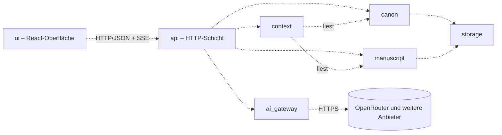
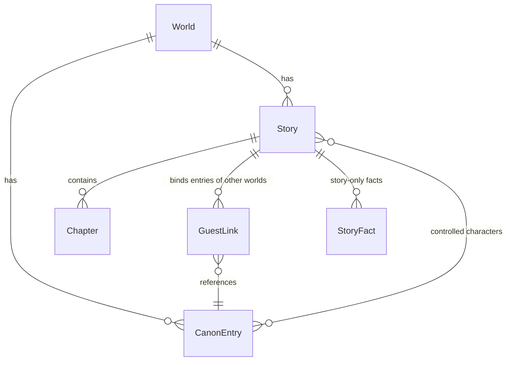

# Architecture – Skriptorium

<!-- Systemarchitektur, Modulgrenzen, Schnittstellenverträge.
     Befüllt in Modus 2 Schritt 4 (templates/projektstart.md Abschnitt 1.3), Klasse M: ein Dokument.
     Jeder Bestandteil trägt einen Reifegrad-Marker. Änderungen an belastbaren Bestandteilen sind
     freigabepflichtig (CLAUDE.md Abschnitt 4). -->

<!-- ANCHOR:reifegrad-system -->
## 0. Reifegrad-System

Jedes Modul, jede Schnittstelle und jede Architektur-Aussage trägt einen der folgenden Marker:

- `[BELASTBAR]` – Entscheidung getroffen, durch Umsetzung validiert oder durch ADR fixiert. Änderung ist freigabepflichtig (CLAUDE.md Abschnitt 4) und erzeugt einen ADR.
- `[VORLÄUFIG]` – Entwurfshypothese, plausibel aber nicht durch Umsetzung validiert. Darf in der Implementierung verfeinert werden, ohne separate Freigabe – jede Verfeinerung wird im Dokument nachgezogen und mit Datum vermerkt.
- `[OFFEN]` – bewusst nicht entschieden. Kein Code in Bereichen, die davon abhängen, bevor die Lücke geschlossen ist.

**Beförderungsregel:** `[VORLÄUFIG]` → `[BELASTBAR]` durch funktionierende Implementierung **oder** ADR; beides mit Datum und Begründung am Eintrag.

**Ausnahme Schutzmechanismen** (Alarme, Überwachung, Backups/Wiederherstellung, Rate-Limits, Release-/Deploy-Gates): Beförderung erst nach einem absichtlich herbeigeführten Fehlerfall, der vollständig durchlief (CLAUDE.md Abschnitt 6).

**Rückstufungsregel:** `[BELASTBAR]` → `[VORLÄUFIG]` oder `[OFFEN]` nur per ADR.

<!-- ANCHOR:ueberblick -->
## 1. Überblick

Das Skriptorium ist eine Web-App für einen einzelnen Autor: ein Python-Server (FastAPI) liefert eine React-Oberfläche mit Markdown-Editor (CodeMirror 6) aus und stellt die Fachfunktionen bereit. Welten, Kanon und Manuskripte liegen als Markdown-Dateien; eine SQLite-Datei dient als jederzeit neu aufbaubarer Suchindex. Prägende Kernentscheidung ist die **Kontext-Zusammenstellung**: Jede KI-Anfrage wird unter einem festen Token-Budget aus Regeln, Kanon-Ausschnitt, verdichtetem Handlungsstand und den letzten Manuskript-Seiten gebaut, statt den ganzen Verlauf mitzuschicken.

**Architektur-Pattern:** Modularer Monolith – eine Betriebseinheit mit fachlich getrennten Modulen `[BELASTBAR]` (ADR-003, Heuristik 1.3: ein Nutzer, ein Betriebsziel, fachliche Komplexität).

**Kommunikations-Grundmodus:** synchron. Oberfläche ↔ Server über HTTP/JSON; KI-Antworten werden per Streaming (Server-Sent Events) Wort für Wort an die Oberfläche weitergereicht. Module im Server rufen einander als Python-Funktionen über ihre öffentlichen Schnittstellen auf. `[VORLÄUFIG]`

<!-- ANCHOR:modul-karte -->
## 2. Modul-Karte

Nur die gezeigten Beziehungen sind erlaubt; jede weitere ist ein Architekturbruch. Gestrichelt = `[VORLÄUFIG]`.



**Leitregeln:** `context` liest nur, schreibt nie. `ai_gateway` kennt keine Fachbegriffe (Welt, Kanon), nur Nachrichten, Modelle und Token. `storage` ist die einzige Stelle, die Dateien und den Index berührt. Die Ablauf-Steuerung (z. B. „Kapitel abschließen → Kurzfassung erzeugen → speichern") liegt in `api`, damit zwischen den Fachmodulen keine Zyklen entstehen.

<!-- ANCHOR:module -->
## 3. Module (detailliert)

### Modul: canon [VORLÄUFIG]

- **Reifegrad:** `[VORLÄUFIG]`, seit 2026-09-26, Begründung: aus Vision und Anforderungen abgeleitet, nicht implementiert
- **Verantwortung:** Welten und ihre Kanon-Einträge (Figur, Ort/Geografie, Gegenstand, Zeitlinie, Regel, Kultur) anlegen, ändern, löschen, finden; Aliasse für die Namenserkennung; einmaliger Import von Welt-Material aus TypingMind (JSON-Export) und Notion (Markdown-Export) (FR-001–FR-005, FR-023).
- **Nicht-Verantwortung:** keine Entscheidung, welche Einträge in eine KI-Anfrage gehören (→ `context`); keine geschichtenbezogenen Fakten (→ `manuscript`).
- **Öffentliche Schnittstellen:** `CanonService` (Abschnitt 4)
- **Interne Struktur:** Import als eigenes Untermodul `canon.importers` mit je einem Importer pro Quelle.
- **Abhängigkeiten (andere Module):** `storage`
- **Abhängigkeiten (extern):** keine
- **Offene Fragen:** Inhalt des TypingMind-Agenten-Exports (enthält er Wissensdateien?) – Klärung an einem echten Export, Fahrplan-Schritt 1.2.

### Modul: manuscript [VORLÄUFIG]

- **Reifegrad:** `[VORLÄUFIG]`, seit 2026-09-26
- **Verantwortung:** Geschichten je Welt (Roman mit Kapiteln, Kurzgeschichte, Fragment), Manuskript-Text, Kapitel-Kurzfassungen und Gesamtzusammenfassung, Einstellungen der Figuren-Schreibweise je Geschichte (welche Figuren der Autor führt, Erzählperspektive), Gast-Verbindungen zu Einträgen anderer Welten und geschichtenbezogene Fakten (FR-007, FR-009, FR-012, FR-016, FR-017, FR-024).
- **Nicht-Verantwortung:** kein Erzeugen von Text oder Zusammenfassungen (→ `ai_gateway`, gesteuert über `api`); kein Welt-Kanon (→ `canon`).
- **Öffentliche Schnittstellen:** `ManuscriptService` (Abschnitt 4)
- **Abhängigkeiten (andere Module):** `storage`
- **Offene Fragen:** Granularität des Wechsels Autor/KI im Manuskript (Absatz-Markierung, wer was schrieb) – verfeinert in der Umsetzung.

### Modul: context [VORLÄUFIG]

- **Reifegrad:** `[VORLÄUFIG]`, seit 2026-09-26, Begründung: Kernverfahren, Tauglichkeit und Budget werden im Erkundungsschritt zur Modellwahl geprüft
- **Verantwortung:** baut aus Welt, Geschichte, Anweisung und `@`-Verweisen eine KI-Anfrage unter festem Token-Budget; Bausteine in Vorrangfolge: (1) Regeln und Schreibanweisung inkl. Figuren-Schreibweise, (2) per `@` genannte Einträge und Einträge der Figuren der Szene, (3) Gesamtzusammenfassung und Kapitel-Kurzfassungen, (4) letzte Manuskript-Seiten wörtlich (füllt den Rest des Budgets). Baut ebenso die Anfrage für Kapitel-Kurzfassungen. Erkennt Kanon-Namen ohne `@` und liefert sie als Vorschläge (FR-008, FR-010, FR-011, FR-013, FR-014).
- **Nicht-Verantwortung:** kein Aufruf der KI, kein Schreiben von Daten.
- **Öffentliche Schnittstellen:** `ContextBuilder` (Abschnitt 4)
- **Abhängigkeiten (andere Module):** `canon`, `manuscript` (nur lesend)
- **NFRs:** Token-Budget je Anfrage (Abschnitt 6); Coverage 90 % (project-context Abschnitt 7).
- **Offene Fragen:** Wert des Token-Budgets; Tokenzählung je Modell (Schätzung vs. Tokenizer) – Erkundungsschritt 1.1.

### Modul: ai_gateway [VORLÄUFIG]

- **Reifegrad:** `[VORLÄUFIG]`, seit 2026-09-26
- **Verantwortung:** einheitliche Anbieter-Schnittstelle für KI-Anfragen mit Streaming; OpenRouter als erster Adapter; weitere Anbieter als zusätzliche Adapter, ohne bestehende zu ändern (FR-018, FR-025); Erfassung von Token-Verbrauch und Kosten je Anfrage.
- **Nicht-Verantwortung:** keine Fachlogik, keine Kontext-Auswahl.
- **Öffentliche Schnittstellen:** `ModelProvider` (Abschnitt 4)
- **Abhängigkeiten (extern):** httpx; OpenRouter-API
- **Offene Fragen:** Verhalten bei Modell-Ablehnung (Inhaltsfilter) – Erkundungsschritt.

### Modul: storage [VORLÄUFIG]

- **Reifegrad:** `[VORLÄUFIG]`, seit 2026-09-26
- **Verantwortung:** Lesen und atomares Schreiben der Markdown-Dateien mit YAML-Kopf (Frontmatter) im Datenverzeichnis; Pflege des SQLite-Suchindex (Namen, Aliasse, Volltext) und dessen vollständiger Neuaufbau aus den Dateien.
- **Nicht-Verantwortung:** keine Fachregeln. Die Dateien sind die Quelle der Wahrheit; der Index enthält nichts, was nicht aus den Dateien wiederherstellbar ist.
- **Öffentliche Schnittstellen:** `DocumentStore` (Abschnitt 4)
- **Abhängigkeiten (extern):** Python-Standardbibliothek (`sqlite3`); YAML-Parser [TBD – freigabepflichtige Abhängigkeit, Auswahl im ersten Umsetzungsschritt]

### Modul: api [VORLÄUFIG]

- **Reifegrad:** `[VORLÄUFIG]`, seit 2026-09-26
- **Verantwortung:** HTTP-Schnittstelle (FastAPI), Zugangsschutz, Ablauf-Steuerung über Modulgrenzen hinweg (z. B. Fortsetzung schreiben, Kapitel abschließen), Auslieferung der gebauten Oberfläche.
- **Nicht-Verantwortung:** keine Fachlogik über das Zusammenschalten hinaus.
- **Abhängigkeiten (andere Module):** `canon`, `manuscript`, `context`, `ai_gateway`

### Modul: ui [VORLÄUFIG]

- **Reifegrad:** `[VORLÄUFIG]`, seit 2026-09-26
- **Verantwortung:** React-Oberfläche: Welt wählen, Einstieg (Szene, Manuskript), Editor mit `@`-Menü, Übernahme markierter Textstellen in den Kanon mit Zielwahl (FR-015, FR-024), Kanon-Pflege, Modellwahl; bedienbar auf dem Smartphone (FR-019).
- **Abhängigkeiten:** nur `api` über HTTP.
- **Technologie:** TypeScript, React, Vite, CodeMirror 6.

<!-- ANCHOR:schnittstellenvertraege -->
## 4. Schnittstellenverträge

Alle Verträge sind `[VORLÄUFIG]` seit 2026-09-26 und werden in der Umsetzung verfeinert; Verfeinerungen werden hier mit Datum nachgezogen.

### Schnittstelle: ModelProvider [VORLÄUFIG]

- **Typ:** Python-Protokoll (Funktions-Export)
- **Anbieter:** `ai_gateway` (je Anbieter ein Adapter)
- **Konsument:** `api`
- **Spezifikation:**
  - **Eingabe:** Modell-Kennung, Liste von Nachrichten (Rolle, Text), Obergrenze für Antwort-Token, Temperatur
  - **Ausgabe (Erfolg):** Strom von Textstücken; am Ende Nutzungsdaten (Eingabe-/Ausgabe-Token, Kosten falls vom Anbieter gemeldet)
  - **Ausgabe (Fehler):** `ProviderUnavailable`, `ModelRefused` (Inhaltsfilter), `RateLimited`, `InvalidRequest`
  - **Idempotenz:** nein (jede Anfrage erzeugt neuen Text)
  - **Timeouts und Retries:** Verbindungsaufbau 10 s; kein automatischer Retry bei begonnenem Strom; einmaliger Retry bei `RateLimited` nach Wartezeit des Anbieters
- **Sicherheit:** API-Schlüssel nur aus Umgebungsvariablen des Servers

### Schnittstelle: ContextBuilder [VORLÄUFIG]

- **Typ:** Python-Funktions-Export
- **Anbieter:** `context`; **Konsument:** `api`
- **Eingabe:** Welt-ID, Geschichte-ID, Kapitel-ID, Anweisung des Autors, Liste der `@`-Verweise, Token-Budget
- **Ausgabe:** Nachrichtenliste für `ModelProvider` plus Protokoll, welche Bausteine mit wie vielen Token enthalten sind (für Nachvollziehbarkeit und Tests)

### Schnittstelle: CanonService, ManuscriptService, DocumentStore [VORLÄUFIG]

- **Typ:** Python-Funktions-Exporte
- **Spezifikation:** CRUD-Operationen auf den Entitäten aus Abschnitt 7; Details entstehen in der Umsetzung und werden hier nachgezogen.

### Schnittstelle: HTTP-API [VORLÄUFIG]

- **Typ:** HTTP-REST (JSON) plus Server-Sent Events für KI-Streaming
- **Anbieter:** `api`; **Konsument:** `ui`
- **Sicherheit:** Anmeldung mit Passwort und Sitzungs-Cookie für alle Endpunkte außer Gesundheitsprüfung und Anmeldung (ASVS Stufe 2 für Authentifizierung und Sitzung)
- **Versionierung:** keine – Oberfläche und Server werden immer gemeinsam ausgeliefert

<!-- ANCHOR:datenfluss -->
## 5. Datenfluss

### Flow: Weiterschreiben im Wechsel [VORLÄUFIG]

1. Autor schreibt im Editor (eigener Text wird gespeichert) und gibt eine Anweisung, ggf. mit `@`-Verweisen.
2. `ui` sendet Anweisung an `api`; `api` lässt `context` die Anfrage bauen (Budget aus Einstellungen).
3. `api` ruft `ai_gateway` mit dem gewählten Modell; Textstücke gehen per Streaming an `ui`.
4. Autor übernimmt, ändert oder verwirft den KI-Text; übernommener Text wird über `manuscript` gespeichert.

**Fehlerpfade:** Abbruch oder Ablehnung des Modells → bisheriger Manuskript-Stand bleibt unverändert; Oberfläche zeigt den Grund und bietet Wiederholen mit anderem Modell an (FR-018).

### Flow: Kapitel abschließen [VORLÄUFIG]

1. Autor markiert ein Kapitel als abgeschlossen.
2. `api` lässt `context` die Anfrage „Kurzfassung" bauen und ruft `ai_gateway`.
3. Kurzfassung und fortgeschriebene Gesamtzusammenfassung werden über `manuscript` gespeichert; Autor kann beide ansehen und ändern.

**Fehlerpfade:** Scheitert die Erzeugung, bleibt das Kapitel abgeschlossen und die Kurzfassung als „fehlt" markiert; `context` nutzt dann ersatzweise den Kapitelanfang wörtlich, bis sie nachgeholt ist.

### Flow: Fakt aus dem Text in den Kanon [VORLÄUFIG]

1. Autor markiert eine Textstelle und wählt „in den Kanon".
2. `ui` schlägt Eintrag und Kategorie vor (Name aus der Markierung, Abgleich über den Index); bei Gast-Figuren Wahl „Kanon der Figur" oder „nur diese Geschichte" (FR-024).
3. `api` speichert über `canon` bzw. `manuscript`. Ziel: unter 10 Sekunden vom Markieren bis zum Speichern (FR-015).

<!-- ANCHOR:nicht-funktionale-anforderungen -->
## 6. Nicht-funktionale Anforderungen

### Performance und Kosten

- **Token-Budget je Schreib-Anfrage:** Startwert 30.000 Token Eingabe `[VORLÄUFIG]` – festgelegt im Erkundungsschritt zur Modellwahl (Fahrplan-Schritt 1.1).
- **Kosten:** Summe aus KI-Verbrauch und Hosting ≤ 50 € je Monat bei regelmäßiger Nutzung (mehrmals pro Woche, je 1–2 Stunden; geschätzt ca. 400 Anfragen im Monat) `[VORLÄUFIG]`. Überschlag: 400 × 30.000 Token = 12 Mio. Token Eingabe; bei 0,50–3 $ je 1 Mio. Token etwa 6–36 $ plus Ausgabe und Kurzfassungen. Messung im Betrieb über die Verbrauchsdaten aus `ai_gateway`.
- **Reaktionszeit:** erstes KI-Textstück sichtbar innerhalb von 5 Sekunden nach dem Absenden, sofern der Anbieter antwortet `[VORLÄUFIG]`.
- **Kontexttreue:** kein Kontextverlust bei einer Geschichte vom Umfang der Referenzgeschichte `[OFFEN]` – Prüfung erst, wenn eine Geschichte diesen Umfang erreicht (Entscheidung des Eigentümers 2026-09-26, ADR-009) – Fahrplan-Schritt D.4 mit Auslöser „Geschichte ≥ 500.000 Token".
- **Kanon-Treue:** höchstens ein beim Redigieren gefundener Widerspruch pro Kapitel `[OFFEN]` – messbar erst im Schreibbetrieb; Vorprüfung im Erkundungsschritt.

### Skalierung

- **Horizontal skalierbare Module:** keine – nicht erforderlich (ein Nutzer, Vision Abschnitt 5) `[BELASTBAR]`
- **Stateful Module:** `storage` (Dateien und Index im Datenverzeichnis); genau eine Server-Instanz `[VORLÄUFIG]`

### Security

Angelegt im Sicherheitsgrundriss (Modus 2 Schritt 4a, 2026-09-26). Das System wird **öffentlich im Internet mit Passwortschutz** betrieben (Entscheidung des Eigentümers); das Gate vor dem ersten öffentlichen Deployment (CLAUDE.md Abschnitt 12) gilt vollständig.

- **Sicherheitsniveau:** OWASP ASVS 5.0.0 Stufe 1 für die gesamte Anwendung; für Authentifizierung und Sitzungsverwaltung Stufe 2 – ADR-006 `[BELASTBAR]`. Obergrenze für allen Sicherheitsaufwand (CLAUDE.md Abschnitt 6).
- **Bedrohungsmodell (Gesamtsystem):** `[VORLÄUFIG]`
  - **Schützenswerte Güter:** (1) API-Schlüssel der KI-Anbieter – höchster Wert, weil Missbrauch direkt Geld kostet; (2) Welten und Manuskripte – Schutzbedarf normal; (3) Verfügbarkeit – gering, Stillstand ist zulässig.
  - **Angreifer:** automatisierte Internet-Scanner und Bots; Passwort-Rater (Credential Stuffing); opportunistische Ausnutzung ungepatchter Software. Kein gezielter Angreifer mit großen Mitteln angenommen.
  - **Bedrohungen und Gegenmaßnahmen:**
    - Passwort-Raten → ein starkes Passwort (Passphrase), gehasht mit einem aktuellen Verfahren; Sperre bzw. Verzögerung nach Fehlversuchen; Anmeldung nur über TLS.
    - Sitzungsdiebstahl über eingeschleustes Skript (XSS) → Markdown-Darstellung ohne ungefiltertes HTML, Content-Security-Policy, Sitzungs-Cookie `HttpOnly`, `Secure`, `SameSite=Strict`.
    - Fremdaufrufe im Namen des Nutzers (CSRF) → `SameSite=Strict` und Prüfung der Herkunft bei ändernden Anfragen.
    - Abfluss des API-Schlüssels → nur serverseitig in Umgebungsvariablen, nie im Browser, Repo oder Log; **Ausgabengrenze am Schlüssel bei OpenRouter** begrenzt den Schaden.
    - Übernahme des Servers über ungepatchte Software → automatische Sicherheitsupdates, Firewall, SSH nur mit Schlüssel (Rubrik Host).
    - Datenverlust (Fehlbedienung, Defekt, Angriff) → Sicherungen mit erprobter Wiederherstellung (Rubrik Backups).
    - Anweisungen in importiertem Material (Prompt Injection) → Wirkung bleibt auf den eigenen KI-Text beschränkt, da die KI keine Werkzeuge ausführt; bewusst nicht weiter abgedeckt.
  - **Bewusst nicht abgedeckt:** gezielte Angriffe mit großen Mitteln; Zugriff durch den Hosting-Anbieter; Vertraulichkeit gegenüber dem KI-Anbieter (Übermittlung ist laut Vision zulässig).
- **Schutzmaßnahmen:** siehe Bedrohungsmodell; Umsetzung im Modul `api` (Anmeldung, Sitzung, Herkunftsprüfung) und `ui` (Darstellung ohne ungefiltertes HTML).
- **Sensitive Datenflüsse:** API-Schlüssel: Umgebungsvariable → `ai_gateway` → HTTPS zum Anbieter. Passwort-Hash: Konfiguration des Servers. Texte: Browser ↔ Server (TLS) → Anbieter (HTTPS).
- **Host:** [TBD – Anbieter und Härtung in Schritt 4.2; Pflicht: Firewall, SSH nur mit Schlüssel, automatische Sicherheitsupdates, Prüfung von außen] `[OFFEN]`
- **Netz:** von außen nur HTTPS (443) und die Umleitung von HTTP (80); SSH [TBD in Schritt 4.2]; TLS-Zertifikat automatisch erneuert `[VORLÄUFIG]`
- **Secrets im Betrieb:** API-Schlüssel und Passwort-Hash als Umgebungsvariablen auf dem Server; Rotationsweg: neuen Schlüssel bei OpenRouter erzeugen, eintragen, alten widerrufen [TBD – Ablageort in Schritt 4.2]. Kein Zugriff der KI auf Produktions-Secrets. `[OFFEN]`
- **Backups und Wiederherstellung:** Datenverzeichnis (Markdown-Dateien) täglich außerhalb des Servers sichern; Index wird nicht gesichert, sondern neu aufgebaut. Ziel und Verfahren [TBD in Schritt 4.3]; Beförderung erst nach erprobter Wiederherstellung. `[OFFEN]`

### Observability

- **Logging:** strukturierte Zeilen (Zeit, Endpunkt, Status, Modell, Token, Kosten); keine Inhalte aus Welten oder Manuskripten `[VORLÄUFIG]`
- **Metriken:** Token-Verbrauch und Kosten je Anfrage und je Monat, einsehbar in der Oberfläche `[VORLÄUFIG]`
- **Tracing:** nicht vorgesehen

### Datenschutz

- **Schutzbedarf:** normal für Welten und Manuskripte („unangenehm, kein Schaden", Eigentümer 2026-09-26) – ADR-007 `[BELASTBAR]`. Obergrenze für alle Datenschutz-Maßnahmen.
- **Datenkategorien:** fiktionale Texte des Eigentümers; personenbezogen sind nur Zugangsdaten des einen Nutzers. Keine Daten Dritter.
- **Speicherort:** Datenverzeichnis auf dem Server; Sicherungen [TBD in Schritt 4.3]; Übermittlung von Ausschnitten an KI-Anbieter (Vision Abschnitt 6).
- **Retention und Löschung:** nach Wunsch des Eigentümers; keine gesetzliche Löschpflicht gegenüber Dritten.

<!-- ANCHOR:datenmodell -->
## 7. Datenmodell

Quelle der Wahrheit sind Markdown-Dateien mit YAML-Kopf; der SQLite-Index ist abgeleitet. Alle Entitäten `[VORLÄUFIG]` seit 2026-09-26.



**Ablage (Vorschlag):**

```text
data/
  worlds/<welt>/world.md                          Welt-Beschreibung, Regeln
  worlds/<welt>/canon/<kategorie>/<eintrag>.md    ein Kanon-Eintrag je Datei (Kopf: Name, Aliasse, Felder)
  worlds/<welt>/stories/<geschichte>/story.md     Form, geführte Figuren, Perspektive, Gast-Verbindungen, Gesamtzusammenfassung
  worlds/<welt>/stories/<geschichte>/chapters/NN-<titel>.md   Kapiteltext, Kopf mit Kurzfassung
  worlds/<welt>/stories/<geschichte>/facts.md     nur für diese Geschichte geltende Fakten (FR-024)
  index.sqlite                                    abgeleiteter Suchindex, jederzeit neu aufbaubar
```

<!-- ANCHOR:verworfene-alternativen -->
## 8. Verworfene Alternativen

- **Anpassung eines vorhandenen Werkzeugs (The Story Nexus, Story Labyrinth, SillyTavern) als Code-Basis:** fremde Form, Rückbau nötig, die unterscheidenden Funktionen wären ohnehin neu zu bauen – siehe ADR-004
- **Obsidian-Plugin statt eigener Web-App:** Empfehlung der KI, vom Eigentümer zugunsten einer eigenen Web-App verworfen – siehe ADR-002
- **Web-App durchgehend in TypeScript:** eine Sprache, aber schwächeres Ökosystem für KI-Werkzeuge nach Einschätzung des Eigentümers – siehe ADR-002
- **Svelte statt React:** höheres Fehlerrisiko bei KI-geschriebenem Code nach der Umstellung von Svelte 5 – siehe ADR-002
- **Mehrere getrennt betriebene Dienste:** kein Nutzen bei einem Nutzer – siehe ADR-003
- **Nur Datenbank als Speicher / nur Dateien ohne Index:** Datenbank allein widerspricht offenen Formaten; Dateien ohne Index (Empfehlung der KI) vom Eigentümer zugunsten von Dateien plus Suchindex verworfen – siehe ADR-003
- **Ganzen Verlauf bei jeder Anfrage mitschicken (Ist-Zustand TypingMind):** Kosten und Kontextgrenzen sind der Anlass des Projekts – siehe ADR-003

<!-- ANCHOR:reifegrad-uebersicht -->
## 9. Reifegrad-Übersicht (Stand vom 2026-09-26)

| Bestandteil | Reifegrad | Seit | Validiert durch / wartet auf |
|---|---|---|---|
| Architektur-Pattern Modularer Monolith | BELASTBAR | 2026-09-26 | ADR-003 |
| Kommunikations-Grundmodus synchron + SSE | VORLÄUFIG | 2026-09-26 | Umsetzung |
| Modul canon | VORLÄUFIG | 2026-09-26 | Beförderung 1.4; Klärung TypingMind-Export 1.2; Umsetzung 2.3, 2.4 |
| Modul manuscript | VORLÄUFIG | 2026-09-26 | Umsetzung |
| Modul context | VORLÄUFIG | 2026-09-26 | Erkundungsschritt 1.1; Beförderung 1.4; Umsetzung 3.2 |
| Modul ai_gateway | VORLÄUFIG | 2026-09-26 | Erkundungsschritte 1.1 (Ablehnungen), 1.3 (httpx); Beförderung 1.4; Umsetzung 3.1 |
| Modul storage | VORLÄUFIG | 2026-09-26 | Umsetzung; Tempo bei großen Geschichten |
| Modul api | VORLÄUFIG | 2026-09-26 | Umsetzung; Zugangsschutz nach 4a |
| Modul ui | VORLÄUFIG | 2026-09-26 | Umsetzung; Smartphone-Test |
| Alle Schnittstellen (Abschnitt 4) | VORLÄUFIG | 2026-09-26 | Umsetzung |
| Datenmodell (Abschnitt 7) | VORLÄUFIG | 2026-09-26 | Umsetzung |
| NFR Token-Budget | VORLÄUFIG | 2026-09-26 | Erkundungsschritt 1.1 |
| NFR Kontexttreue Referenzumfang | OFFEN | 2026-09-26 | Schritt D.4 (Geschichte ≥ 500.000 Token) |
| NFR Kanon-Treue | OFFEN | 2026-09-26 | Schreibbetrieb ab 3.3, Vorprüfung in 1.1 |
| Sicherheitsniveau ASVS 5.0.0 L1 / Auth L2 | BELASTBAR | 2026-09-26 | ADR-006 |
| Bedrohungsmodell Gesamtsystem | VORLÄUFIG | 2026-09-26 | Prüfung 4.5, Gate-Schritt 4.6 |
| Schutzbedarf normal | BELASTBAR | 2026-09-26 | ADR-007 |
| Host, Secrets im Betrieb, Backups | OFFEN | 2026-09-26 | Schritte 4.2, 4.3, Gate-Schritt 4.6 |
| Netz (nur HTTPS von außen) | VORLÄUFIG | 2026-09-26 | Schritt 4.2, Gate-Schritt 4.6 |

<!-- ANCHOR:tooling-inventar -->
## 10. Tooling-Inventar

Hilfsskripte sind Architektur-Bestandteile mit eigenem Reifegrad (Pflichten A–H aus CLAUDE.md Abschnitt 15). Reifegrad-Skala: `[ROH]` → `[GEHÄRTET]` → `[KRITISCH]`, Beförderungsregeln wie in der Vorlage `templates/docs/architecture.md` Abschnitt 10.

### Inventar

| Skript | Zweck | Reifegrad | Plattform-Matrix | Voraussetzungen | Idempotenz |
|---|---|---|---|---|---|
| – | noch keine Skripte (Stand 2026-09-26) | – | – | – | – |
