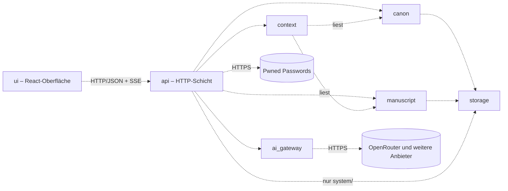
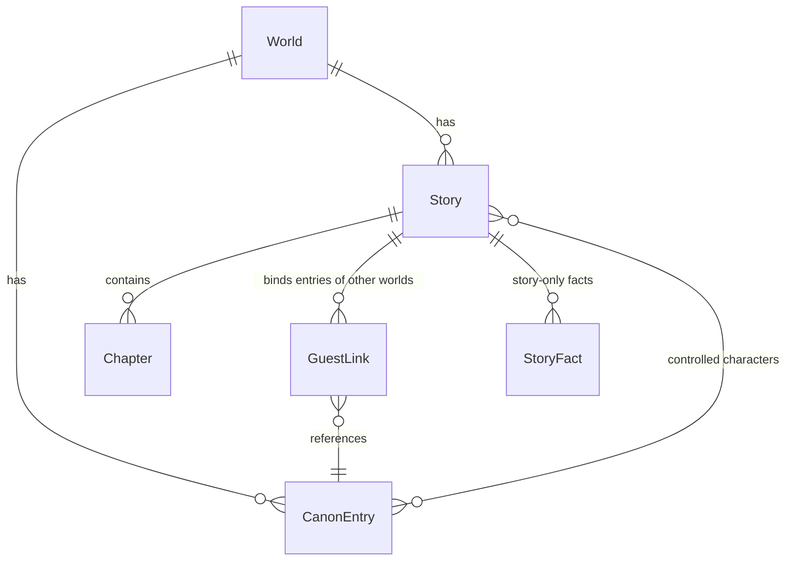

# Architecture – Skriptorium

<!-- Systemarchitektur, Modulgrenzen, Schnittstellenverträge.
     Befüllt in Modus 2 Schritt 4 (templates/projektstart.md Abschnitt 1.3), Klasse M: ein Dokument.
     Jeder Bestandteil trägt einen Reifegrad-Marker. Änderungen an belastbaren Bestandteilen sind
     freigabepflichtig (CLAUDE.md Abschnitt 4). -->

<!-- ANCHOR:reifegrad-system -->
## 0. Reifegrad-System

Jedes Modul, jede Schnittstelle und jede Architektur-Aussage trägt einen der folgenden Marker:

- `[BELASTBAR]` – Entscheidung getroffen, durch Umsetzung validiert oder durch ADR fixiert. Änderung ist freigabepflichtig (CLAUDE.md Abschnitt 4) und erzeugt einen ADR.
- `[VORLÄUFIG]` – Entwurfshypothese, plausibel aber nicht durch Umsetzung validiert. Darf in der Implementierung verfeinert werden, ohne separate Freigabe – jede Verfeinerung wird im Dokument nachgezogen und mit Datum vermerkt.
- `[OFFEN]` – bewusst nicht entschieden. Kein Code in Bereichen, die davon abhängen, bevor die Lücke geschlossen ist.

**Beförderungsregel:** `[VORLÄUFIG]` → `[BELASTBAR]` durch funktionierende Implementierung **oder** ADR; beides mit Datum und Begründung am Eintrag.

**Ausnahme Schutzmechanismen** (Alarme, Überwachung, Backups/Wiederherstellung, Rate-Limits, Release-/Deploy-Gates): Beförderung erst nach einem absichtlich herbeigeführten Fehlerfall, der vollständig durchlief (CLAUDE.md Abschnitt 6).

**Rückstufungsregel:** `[BELASTBAR]` → `[VORLÄUFIG]` oder `[OFFEN]` nur per ADR.

<!-- ANCHOR:ueberblick -->
## 1. Überblick

Das Skriptorium ist eine Web-App für einen einzelnen Autor: ein Python-Server (FastAPI) liefert eine React-Oberfläche mit Markdown-Editor (CodeMirror 6) aus und stellt die Fachfunktionen bereit. Welten, Kanon und Manuskripte liegen als Markdown-Dateien; eine SQLite-Datei dient als jederzeit neu aufbaubarer Suchindex. Prägende Kernentscheidung ist die **Kontext-Zusammenstellung**: Jede KI-Anfrage wird unter einem festen Token-Budget aus Regeln, Kanon-Ausschnitt, verdichtetem Handlungsstand und den letzten Manuskript-Seiten gebaut, statt den ganzen Verlauf mitzuschicken.

**Architektur-Pattern:** Modularer Monolith – eine Betriebseinheit mit fachlich getrennten Modulen `[BELASTBAR]` (ADR-003, Heuristik 1.3: ein Nutzer, ein Betriebsziel, fachliche Komplexität).

**Kommunikations-Grundmodus:** synchron. Oberfläche ↔ Server über HTTP/JSON; KI-Antworten werden per Streaming (Server-Sent Events) Wort für Wort an die Oberfläche weitergereicht. Module im Server rufen einander als Python-Funktionen über ihre öffentlichen Schnittstellen auf. `[BELASTBAR]` (ADR-013; Streaming vom Anbieter mit httpx in 1.3 erprobt)

<!-- ANCHOR:modul-karte -->
## 2. Modul-Karte

Nur die gezeigten Beziehungen sind erlaubt; jede weitere ist ein Architekturbruch. Alle Beziehungen `[BELASTBAR]` seit 2026-09-26 (ADR-013); die Striche der Grafik bleiben aus der Entwurfszeit.



**Leitregeln:** `context` liest nur, schreibt nie. `ai_gateway` kennt keine Fachbegriffe (Welt, Kanon), nur Nachrichten, Modelle und Token. `storage` ist die einzige Stelle, die Dateien und den Index berührt; `api` nutzt `storage` nur für die Zugangsdaten unter `system/` und fragt beim Festlegen eines Passworts Pwned Passwords ab (ADR-018, 2026-09-26). Die Ablauf-Steuerung (z. B. „Kapitel abschließen → Kurzfassung erzeugen → speichern") liegt in `api`, damit zwischen den Fachmodulen keine Zyklen entstehen.

<!-- ANCHOR:module -->
## 3. Module (detailliert)

### Modul: canon [BELASTBAR]

- **Reifegrad:** `[BELASTBAR]`, seit 2026-09-26, per ADR-013 (Beförderung in Schritt 1.4) – vorher Begründung: aus Vision und Anforderungen abgeleitet, nicht implementiert
- **Verantwortung:** Welten und ihre Kanon-Einträge (Figur, Ort/Geografie, Gegenstand, Zeitlinie, Regel, Kultur) anlegen, ändern, löschen, finden; Aliasse für die Namenserkennung; einmaliger Import von Welt-Material, zunächst als Markdown (ADR-012); Importer für TypingMind und Notion später (Schritte V.4, V.5) (FR-001–FR-005, FR-023).
- **Nicht-Verantwortung:** keine Entscheidung, welche Einträge in eine KI-Anfrage gehören (→ `context`); keine geschichtenbezogenen Fakten (→ `manuscript`).
- **Öffentliche Schnittstellen:** `CanonService` (Abschnitt 4)
- **Interne Struktur:** Import als eigenes Untermodul `canon.importers` mit je einem Importer pro Quelle; erste Ausbaustufe nur Markdown (ADR-012).
- **Abhängigkeiten (andere Module):** `storage`
- **Abhängigkeiten (extern):** keine
- **Offene Fragen:** Inhalt des TypingMind-Agenten-Exports – für die erste Ausbaustufe gegenstandslos (ADR-012), Klärung in Schritt V.4.

### Modul: manuscript [BELASTBAR]

- **Reifegrad:** `[BELASTBAR]`, seit 2026-09-26, per ADR-013 (Beförderung in Schritt 1.4)
- **Verantwortung:** Geschichten je Welt (Roman mit Kapiteln, Kurzgeschichte, Fragment), Manuskript-Text, Kapitel-Kurzfassungen und Gesamtzusammenfassung, Einstellungen der Figuren-Schreibweise je Geschichte (welche Figuren der Autor führt, Erzählperspektive), Gast-Verbindungen zu Einträgen anderer Welten und geschichtenbezogene Fakten (FR-007, FR-009, FR-012, FR-016, FR-017, FR-024).
- **Nicht-Verantwortung:** kein Erzeugen von Text oder Zusammenfassungen (→ `ai_gateway`, gesteuert über `api`); kein Welt-Kanon (→ `canon`).
- **Öffentliche Schnittstellen:** `ManuscriptService` (Abschnitt 4)
- **Abhängigkeiten (andere Module):** `storage`
- **Offene Fragen:** keine. Geklärt in 1.4 (2026-09-26): keine Markierung, wer welchen Absatz schrieb – FR-009 verlangt nur, dass übernommener, geänderter oder verworfener KI-Text im selben Manuskript landet; der Manuskript-Text ist ein fortlaufender Markdown-Text (einfachste Lösung, erweiterbar per Markierung, falls später nötig).

### Modul: context [BELASTBAR]

- **Reifegrad:** `[BELASTBAR]`, seit 2026-09-26, per ADR-013 (Beförderung in Schritt 1.4) – vorher Begründung: Kernverfahren in 1.1 und 1.5 an einer Testwelt erprobt (86 Läufe, Vorrangfolge von Hand nachgebaut)
- **Verantwortung:** baut aus Welt, Geschichte, Anweisung und `@`-Verweisen eine KI-Anfrage unter festem Token-Budget; Bausteine in Vorrangfolge: (1) Regeln und Schreibanweisung inkl. Figuren-Schreibweise, (2) per `@` genannte Einträge und Einträge der Figuren der Szene, (3) Gesamtzusammenfassung und Kapitel-Kurzfassungen, (4) letzte Manuskript-Seiten wörtlich (füllt den Rest des Budgets). Baut ebenso die Anfrage für Kapitel-Kurzfassungen. Erkennt Kanon-Namen ohne `@` und liefert sie als Vorschläge (FR-008, FR-010, FR-011, FR-013, FR-014).
- **Nicht-Verantwortung:** kein Aufruf der KI, kein Schreiben von Daten.
- **Öffentliche Schnittstellen:** `ContextBuilder` (Abschnitt 4)
- **Abhängigkeiten (andere Module):** `canon`, `manuscript` (nur lesend)
- **NFRs:** Token-Budget je Anfrage (Abschnitt 6); Coverage 90 % (project-context Abschnitt 7).
- **Offene Fragen:** keine. Geklärt in 1.1 (ADR-010): Budget 30.000 Token Eingabe als Obergrenze; Tokenzählung per Schätzung 3,3 Zeichen je Token mit 10 % Sicherheitsabschlag (Abweichung zu den Anbieter-Zählungen −6 % bis +8 %), kein Tokenizer je Modell. Reihenfolge in der Anfrage: feste Bausteine (Regeln, Welt, Kanon) zuerst, veränderliche (Handlungsstand, letzte Seiten, Anweisung) zuletzt – Zwischenspeicher der Anbieter senkt so die Kosten.

### Modul: ai_gateway [BELASTBAR]

- **Reifegrad:** `[BELASTBAR]`, seit 2026-09-26, per ADR-013 (Beförderung in Schritt 1.4)
- **Verantwortung:** einheitliche Anbieter-Schnittstelle für KI-Anfragen mit Streaming; OpenRouter als erster Adapter; weitere Anbieter als zusätzliche Adapter, ohne bestehende zu ändern (FR-018, FR-025); Erfassung von Token-Verbrauch und Kosten je Anfrage; Modell-Konfiguration je Modell (Reasoning aus oder niedrigste Stufe, weil manche Modelle Reasoning verlangen; ausgeschlossene ausführende Anbieter, z. B. solche mit Training auf Eingaben). Modellreihenfolge: grok-4.7 → grok-4.6 → qwen3.8-max (ADR-010, ADR-011).
- **Nicht-Verantwortung:** keine Fachlogik, keine Kontext-Auswahl.
- **Öffentliche Schnittstellen:** `ModelProvider` (Abschnitt 4)
- **Abhängigkeiten (extern):** httpx; OpenRouter-API
- **Offene Fragen:** keine. Geklärt in 1.1/1.3: `finish_reason: content_filter` → `ModelRefused`; textliche Weigerung ist technisch nicht erkennbar → Oberfläche bietet bei jedem KI-Text „mit anderem Modell wiederholen"; httpx 0.28.1 trägt auf Python 3.14.7; ein `httpx.AsyncClient` wird beim Start angelegt und wiederverwendet.

### Modul: storage [BELASTBAR]

- **Reifegrad:** `[BELASTBAR]`, seit 2026-09-26, per ADR-013 (Beförderung in Schritt 1.4)
- **Verantwortung:** Lesen und atomares Schreiben der Markdown-Dateien mit YAML-Kopf (Frontmatter) im Datenverzeichnis; Pflege des SQLite-Suchindex (Namen, Aliasse, Volltext) und dessen vollständiger Neuaufbau aus den Dateien.
- **Nicht-Verantwortung:** keine Fachregeln. Die Dateien sind die Quelle der Wahrheit; der Index enthält nichts, was nicht aus den Dateien wiederherstellbar ist.
- **Öffentliche Schnittstellen:** `DocumentStore` (Abschnitt 4)
- **Abhängigkeiten (extern):** Python-Standardbibliothek (`sqlite3`); PyYAML 6.0 (ADR-016), gelesen mit strengem sicherem Lader

### Modul: api [BELASTBAR]

- **Reifegrad:** `[BELASTBAR]`, seit 2026-09-26, per ADR-013 (Beförderung in Schritt 1.4)
- **Verantwortung:** HTTP-Schnittstelle (FastAPI), Zugangsschutz (Anmeldung, Sitzungen, Passwort-Verwaltung nach ADR-017), Ablauf-Steuerung über Modulgrenzen hinweg (z. B. Fortsetzung schreiben, Kapitel abschließen), Auslieferung der gebauten Oberfläche.
- **Nicht-Verantwortung:** keine Fachlogik über das Zusammenschalten hinaus.
- **Interne Struktur:** Zugangsschutz als Untermodul `api.access` (Passwort-Hashing, Prüfung neuer Passwörter, Sitzungen, Schutz vor Raten); die Endpunkte der Fachmodule getrennt davon.
- **Abhängigkeiten (andere Module):** `canon`, `manuscript`, `context`, `ai_gateway`; `storage` nur für `system/` (ADR-018)
- **Abhängigkeiten (extern):** httpx (Pwned Passwords, ADR-017)

### Modul: ui [BELASTBAR]

- **Reifegrad:** `[BELASTBAR]`, seit 2026-09-26, per ADR-013 (Beförderung in Schritt 1.4)
- **Verantwortung:** React-Oberfläche: Welt wählen, Einstieg (Szene, Manuskript), Editor mit `@`-Menü, Übernahme markierter Textstellen in den Kanon mit Zielwahl (FR-015, FR-024), Kanon-Pflege, Modellwahl; bedienbar auf dem Smartphone (FR-019).
- **Abhängigkeiten:** nur `api` über HTTP.
- **Technologie:** TypeScript, React, Vite, CodeMirror 6.
- **Umgesetzt in 2.7 (2026-09-26):** Anmeldung, Einrichtung mit Code, Passwortwechsel mit Namensnennung Pwned Passwords, Sitzungsübersicht, Abmelden auf jeder Seite (ADR-017); Welten, Kanon-Einträge je Kategorie, Markdown-Import mit Vorschau, Geschichten und Kapitel mit CodeMirror-Editor (Markdown-Quelltext, keine HTML-Darstellung; Editor wird nachgeladen). Navigation ohne Router-Bibliothek. Content-Security-Policy als Meta-Tag im gebauten `index.html` (`script-src 'self'`, `object-src 'none'`, `base-uri 'none'`, `form-action 'self'`; `style-src` mit `'unsafe-inline'` für CodeMirror; `frame-ancestors` nur per HTTP-Kopf, Schritt 4.2). Endet die Sitzung während der Arbeit, erscheint die Anmeldung über der offenen Ansicht, ungespeicherter Text bleibt stehen. `@`-Menü, Modellwahl und Übernahme in den Kanon folgen in Phase 3.

<!-- ANCHOR:schnittstellenvertraege -->
## 4. Schnittstellenverträge

Alle Verträge sind `[BELASTBAR]` seit 2026-09-26 (ADR-013). Die Umsetzung formuliert Signaturen und Felder aus; Verfeinerungen innerhalb der Grobverträge werden hier mit Datum nachgezogen, Änderungen an Operationen oder Endpunkt-Gruppen sind Schnittstellenänderungen (`CLAUDE.md` Abschnitt 4).

### Schnittstelle: ModelProvider [BELASTBAR]

- **Typ:** Python-Protokoll (Funktions-Export)
- **Anbieter:** `ai_gateway` (je Anbieter ein Adapter)
- **Konsument:** `api`
- **Spezifikation:**
  - **Eingabe:** Modell-Kennung, Liste von Nachrichten (Rolle, Text), Obergrenze für Antwort-Token, Temperatur; Reasoning-Einstellung und Anbieter-Ausschlüsse kommen aus der Modell-Konfiguration, nicht vom Aufrufer
  - **Ausgabe (Erfolg):** Strom von Textstücken; am Ende Nutzungsdaten (Eingabe-/Ausgabe-Token, Kosten falls vom Anbieter gemeldet)
  - **Ausgabe (Fehler):** `ProviderUnavailable` (Netz, HTTP 5xx, `error` im Strom ohne Filterbezug), `ModelRefused` (`finish_reason: content_filter` oder Filter-Fehler im Strom), `RateLimited` (HTTP 429), `InvalidRequest` (HTTP 400, z. B. „Reasoning is mandatory")
  - **Idempotenz:** nein (jede Anfrage erzeugt neuen Text)
  - **Timeouts und Retries:** Verbindungsaufbau 10 s; Wartezeit bis zum ersten Textstück bis 90 s (Modelle mit Vorab-Denken brauchten bis 50 s); danach höchstens 30 s zwischen zwei Textstücken; kein automatischer Retry bei begonnenem Strom; einmaliger Retry bei `RateLimited` nach Wartezeit des Anbieters (im Test trat 429 auf und verschwand beim Wiederholen)
- **Sicherheit:** API-Schlüssel nur aus Umgebungsvariablen des Servers

### Schnittstelle: ContextBuilder [BELASTBAR]

- **Typ:** Python-Funktions-Export
- **Anbieter:** `context`; **Konsument:** `api`
- **Eingabe:** Welt-ID, Geschichte-ID, Kapitel-ID, Anweisung des Autors, Liste der `@`-Verweise, Token-Budget (Obergrenze 30.000, ADR-010)
- **Ausgabe:** Nachrichtenliste für `ModelProvider` plus Protokoll, welche Bausteine mit wie vielen Token enthalten sind (für Nachvollziehbarkeit und Tests)

### Schnittstelle: CanonService, ManuscriptService, DocumentStore [BELASTBAR]

- **Typ:** Python-Funktions-Exporte
- **Grobvertrag (1.4, 2026-09-26):** Operationen je Dienst; Signaturen und Fehlerarten werden in 2.2–2.5 ausformuliert, ohne Operationen hinzuzufügen oder wegzulassen (sonst Schnittstellenänderung nach `CLAUDE.md` Abschnitt 4).
  - **DocumentStore** (`storage`): Dokument lesen (Kopf + Text), atomar schreiben, löschen, unter einem Pfad auflisten; Suche nach Name/Alias/Volltext innerhalb einer Welt; Index vollständig aus den Dateien neu aufbauen.
    - **Ausformuliert in 2.2 (2026-09-26):** `DocumentStore(root: Path)`; `read(path) -> Document`; `write(path, header, body, *, create=False) -> Document`; `delete(path)`; `list_paths(prefix="") -> list[str]`; `search(world, query, mode="name" | "fulltext") -> list[SearchHit]`; `rebuild_index()`. `Document(path, header, body)`, `SearchHit(path, name)`. Pfade sind relativ (POSIX) unterhalb des Datenverzeichnisses und enden auf `.md`; `..`, absolute Pfade und Backslashes ergeben `InvalidInput`. Indexiert werden Dokumente unter `worlds/<welt>/`: Name aus `name` oder `titel`, sonst Dateiname; Aliasse aus `aliasse`; Volltext über SQLite FTS5 (Groß-/Kleinschreibung und diakritische Zeichen egal). Namenssuche per Präfix. Der Dateikopf wird streng gelesen: mehrdeutige YAML-1.1-Werte (z. B. `No`, `On`, `012`) und Nicht-Grundwerte (`!!binary`, `!!set`) ergeben `InvalidInput` (ADR-016). Die gemeinsamen Fehlerarten sind in `skriptorium.storage` definiert.
  - **CanonService** (`canon`): Welten auflisten, lesen, anlegen, ändern; Kanon-Einträge einer Welt auflisten (optional nach Kategorie), lesen, anlegen, ändern, löschen; Einträge nach Name oder Alias finden (für `@`-Menü und Vorschläge); Markdown-Import als Vorschau erzeugen und bestätigt übernehmen (ADR-012).
    - **Ausformuliert in 2.3 (2026-09-26, ohne Import – folgt in 2.4):** `CanonService(store)`; `list_worlds()`, `get_world(world_id)`, `create_world(name, description="")`, `update_world(world_id, *, name, description)`; `list_entries(world_id, category=None)`, `get_entry(world_id, entry_id)`, `create_entry(world_id, category, name, *, aliases=(), status=None, body="")`, `update_entry(world_id, entry_id, *, category, name, aliases, status, body)` (nicht übergebene Felder bleiben), `delete_entry(world_id, entry_id)`, `find_entries(world_id, text)`. Kennungen werden aus dem Namen gebildet (klein, Umlaute umschrieben, Bindestriche) und sind die Dateinamen; eine Eintrags-Kennung ist je Welt über alle Kategorien eindeutig. Kategoriewechsel verschiebt die Datei. Unbekannte Kopffelder bleiben beim Ändern erhalten. Neue Gegenstände ohne Text bekommen die Abschnitte Zweck, Verwendung, Auswirkung (FR-003). Die Zeitlinie ist ein Eintrag der Kategorie `zeitlinie`, dessen Text die Ereignisse in Reihenfolge auflistet (wie in der Testwelt aus 1.1). Fehlerarten aus `storage`, von `canon` weitergereicht.
    - **Import ausformuliert in 2.4 (2026-09-26):** `preview_import(world_id, markdown) -> ImportPreview` (speichert nichts; je Eintrag Kennung, Name, erkannte Kategorie, Aliasse, Text und Konflikt `vorhanden`/`doppelt`) und `apply_import(world_id, markdown, *, categories={}, overwrite=set()) -> ImportResult` (Einleitung wird an die Weltbeschreibung angehängt; Konflikte werden übersprungen, außer ihre Kennung steht in `overwrite`; fehlt einem zu speichernden Eintrag die Kategorie, wird nichts gespeichert). Aufteilungsregeln (vom Eigentümer bestätigt): Überschriften werden Einträge, Gruppen-Überschriften mit Kategorie-Wort (Figuren, Orte, …) setzen die Kategorie, eine Zeile `Kategorie:` hat Vorrang, `Aliasse:`/`Auch genannt:` liefert Aliasse; Unterüberschriften bleiben im Text; Überschriften in Code-Blöcken zählen nicht. Umsetzung in `canon.importers.markdown` (reiner Zerleger) und `canon.categories`.
  - **ManuscriptService** (`manuscript`): Geschichten einer Welt auflisten, lesen, anlegen, ändern (Form, Perspektive, geführte Figuren); Kapitel auflisten, lesen, speichern, abschließen; Kurzfassung eines Kapitels und Gesamtzusammenfassung setzen; Gast-Verbindungen hinzufügen und entfernen; geschichtenbezogene Fakten hinzufügen und entfernen.
    - **Ausformuliert in 2.5 (2026-09-26):** `ManuscriptService(store)`; `list_stories(world_id)`, `get_story(world_id, story_id)` (mit Gast-Verbindungen und Fakten), `create_story(world_id, title, form, *, perspective=None, controlled_characters=())`, `update_story(world_id, story_id, *, title, form, perspective, controlled_characters)`, `set_story_summary(...)`; `list_chapters(...)`, `get_chapter(..., number)`, `save_chapter(..., number, *, title, text)` (die nächste freie Nummer legt ein Kapitel an), `complete_chapter(...)`, `set_chapter_summary(..., number, summary, status)`; `add_guest_link`/`remove_guest_link(..., guest_world, entry)`, `add_fact`/`remove_fact(..., entry, fact)`. Nur ein Roman hat mehrere Kapitel; Kurzgeschichte und Fragment bekommen beim Anlegen ihr einziges Kapitel, weil das Datenmodell allen Manuskript-Text in Kapiteldateien führt. Kapiteldatei `NN-<titel>.md`, Umbenennen verschiebt sie. Gast-Verbindungen führen immer in eine andere Welt. Verweise auf Kanon-Einträge und die Existenz der Welt prüft die Ablauf-Steuerung in `api`, weil `manuscript` nicht von `canon` abhängt. Die Kennungsbildung (`slugify`, `checked_identifier`) liegt seit 2.5 in `storage` und wird von `canon` und `manuscript` genutzt.
- **Fehler (gemeinsam):** `NotFound`, `AlreadyExists`, `InvalidInput`; `storage` zusätzlich `StorageError` bei Schreibfehlern (Datei bleibt dann unverändert).

### Schnittstelle: HTTP-API [BELASTBAR]

- **Typ:** HTTP-REST (JSON) plus Server-Sent Events für KI-Streaming
- **Anbieter:** `api`; **Konsument:** `ui`
- **Sicherheit:** Anmeldung mit Passwort und Sitzungs-Cookie für alle Endpunkte außer Gesundheitsprüfung und Anmeldung (ASVS Stufe 2 für Authentifizierung und Sitzung)
- **Versionierung:** keine – Oberfläche und Server werden immer gemeinsam ausgeliefert
- **Grobvertrag (1.4, 2026-09-26):** Endpunkt-Gruppen, je eine Operation der Dienste aus den Grobverträgen oben; Pfade und Felder werden in 2.6 ausformuliert, ohne Gruppen hinzuzufügen oder wegzulassen.
  - Gesundheitsprüfung (ohne Anmeldung); Anmelden, Abmelden (ohne Sitzung zugänglich nur Anmelden)
  - Welten; Kanon-Einträge einer Welt; Suche nach Name/Alias; Markdown-Import (Vorschau, Übernahme)
  - Geschichten einer Welt; Kapitel; Kapitel abschließen (löst Kurzfassung aus); Gast-Verbindungen; geschichtenbezogene Fakten
  - Schreiben: Anweisung senden → KI-Text als Server-Sent Events (Textstücke, dann Nutzungsdaten oder Fehlerart); Abbruch durch Schließen der Verbindung
  - Modelle: verfügbare Modelle und Voreinstellung lesen, Modell je Geschichte wählen
  - **Erweitert mit ADR-017 (2026-09-26):** Einrichtung mit Einrichtungscode (ohne Sitzung); eigene Sitzung lesen, Passwort ändern, Sitzungen auflisten und beenden.
  - **Ausformuliert in 2.6 (2026-09-26)** – Gruppen „Schreiben" und „Modelle" folgen in 3.3 und 3.9. Alle Körper JSON; ändernde Anfragen brauchen einen `Origin`-Kopf des eigenen Hosts (sonst 403) und mit Inhalt `Content-Type: application/json` (sonst 415). Fehler: 401 ohne gültige Sitzung, 404 `NotFound`, 409 `AlreadyExists`, 422 `InvalidInput` bzw. ungültige Felder, 429 Sperre nach Fehlversuchen, 500 `StorageError` ohne Einzelheiten, 503 Pwned Passwords nicht erreichbar.
    - `GET /api/health` (ohne Sitzung)
    - `POST /api/auth/setup` `{code, password}` → 204, beendet alle Sitzungen (ohne Sitzung; 403 bei ungültigem Code, 422 `{reason}` mit `too_short`, `too_long`, `context_word`, `breached`)
    - `POST /api/auth/login` `{password}` → 204 mit Cookie `__Host-sitzung` (ohne Sitzung; 401 falsches Passwort, 409 noch kein Passwort)
    - `POST /api/auth/logout` → 204; `GET /api/auth/session` → Sitzung; `POST /api/auth/password` `{current_password, new_password, end_other_sessions}` → 204 mit neuem Cookie (403 bei falschem bisherigem Passwort); `GET /api/auth/sessions` → Liste `{id, created, last_seen, client, current}`; `DELETE /api/auth/sessions` beendet alle anderen; `DELETE /api/auth/sessions/{id}`
    - `GET|POST /api/worlds`; `GET|PATCH /api/worlds/{world_id}`; `GET|POST /api/worlds/{world_id}/entries` (`?category=`); `GET|PATCH|DELETE /api/worlds/{world_id}/entries/{entry_id}`; `GET /api/worlds/{world_id}/search?text=`; `POST /api/worlds/{world_id}/import/preview` `{markdown}`; `POST /api/worlds/{world_id}/import` `{markdown, categories, overwrite}`
    - `GET|POST /api/worlds/{world_id}/stories`; `GET|PATCH /api/worlds/{world_id}/stories/{story_id}`; `PUT …/summary` `{summary}`; `POST …/guests` `{world, entry}`; `DELETE …/guests/{guest_world}/{entry}`; `POST|DELETE …/facts` `{entry, fact}`; `GET …/chapters`; `GET|PUT …/chapters/{number}` `{title, text}` (die nächste freie Nummer legt ein Kapitel an); `POST …/chapters/{number}/complete`; `PUT …/chapters/{number}/summary` `{summary, status}`
    - PATCH und PUT ändern nur mitgeschickte Felder; `null` leert `status` bzw. `perspective`. Die Ablauf-Steuerung prüft die Existenz der Welt und der Kanon-Verweise (geführte Figuren und Fakten: Eintrag der Welt oder Gast der Geschichte; Gast-Verbindung: Eintrag der anderen Welt) und antwortet sonst mit 422.
    - Die gebaute Oberfläche (`dist/ui`) wird ohne Sitzung unter `/` ausgeliefert; sie enthält keine Daten.

<!-- ANCHOR:datenfluss -->
## 5. Datenfluss

### Flow: Weiterschreiben im Wechsel [BELASTBAR]

1. Autor schreibt im Editor (eigener Text wird gespeichert) und gibt eine Anweisung, ggf. mit `@`-Verweisen.
2. `ui` sendet Anweisung an `api`; `api` lässt `context` die Anfrage bauen (Budget aus Einstellungen).
3. `api` ruft `ai_gateway` mit dem gewählten Modell; Textstücke gehen per Streaming an `ui`.
4. Autor übernimmt, ändert oder verwirft den KI-Text; übernommener Text wird über `manuscript` gespeichert.

**Fehlerpfade:** Abbruch oder Ablehnung des Modells → bisheriger Manuskript-Stand bleibt unverändert; Oberfläche zeigt den Grund und bietet Wiederholen mit anderem Modell an (FR-018).

### Flow: Kapitel abschließen [BELASTBAR]

1. Autor markiert ein Kapitel als abgeschlossen.
2. `api` lässt `context` die Anfrage „Kurzfassung" bauen und ruft `ai_gateway`.
3. Kurzfassung und fortgeschriebene Gesamtzusammenfassung werden über `manuscript` gespeichert; Autor kann beide ansehen und ändern.

**Fehlerpfade:** Scheitert die Erzeugung, bleibt das Kapitel abgeschlossen und die Kurzfassung als „fehlt" markiert; `context` nutzt dann ersatzweise den Kapitelanfang wörtlich, bis sie nachgeholt ist.

### Flow: Fakt aus dem Text in den Kanon [BELASTBAR]

1. Autor markiert eine Textstelle und wählt „in den Kanon".
2. `ui` schlägt Eintrag und Kategorie vor (Name aus der Markierung, Abgleich über den Index); bei Gast-Figuren Wahl „Kanon der Figur" oder „nur diese Geschichte" (FR-024).
3. `api` speichert über `canon` bzw. `manuscript`. Ziel: unter 10 Sekunden vom Markieren bis zum Speichern (FR-015).

<!-- ANCHOR:nicht-funktionale-anforderungen -->
## 6. Nicht-funktionale Anforderungen

### Performance und Kosten

- **Token-Budget je Schreib-Anfrage:** Obergrenze 30.000 Token Eingabe `[BELASTBAR]` (ADR-013) – in 1.1 bestätigt (ADR-010): zwischen 8.000 und 17.600 Token kein messbarer Unterschied in der Kanon-Treue; Obergrenze bleibt für größere Welten, Verhalten oberhalb 17.600 Token wird im Schreibbetrieb beobachtet (3.2, D.4). Feste Teile (Regeln, Kanon) stehen am Anfang der Anfrage (Zwischenspeicher der Anbieter senkt die Kosten).
- **Kosten:** Summe aus KI-Verbrauch und Hosting ≤ 50 € je Monat bei regelmäßiger Nutzung (mehrmals pro Woche, je 1–2 Stunden; geschätzt ca. 400 Anfragen im Monat) `[VORLÄUFIG]`. Überschlag: 400 × 30.000 Token = 12 Mio. Token Eingabe; bei 0,50–3 $ je 1 Mio. Token etwa 6–36 $ plus Ausgabe und Kurzfassungen. Messung im Betrieb über die Verbrauchsdaten aus `ai_gateway`.
- **Reaktionszeit:** innerhalb 1 s nach dem Absenden zeigt die Oberfläche „denkt nach …" mit laufender Zeit; erstes KI-Textstück beim Startmodell grok-4.7 innerhalb 60 s, beim Zweitmodell grok-4.6 innerhalb 10 s; Abbruch und Wechsel auf grok-4.6 jederzeit möglich `[BELASTBAR]` (Eigentümer, 2026-09-26, ADR-013; ersetzt das Ziel „erstes Textstück in 5 s", das mit dem Startmodell nicht erreichbar ist – gemessen 15–50 s bzw. 5–8 s).
- **Kontexttreue:** kein Kontextverlust bei einer Geschichte vom Umfang der Referenzgeschichte `[OFFEN]` – Prüfung erst, wenn eine Geschichte diesen Umfang erreicht (Entscheidung des Eigentümers 2026-09-26, ADR-009) – Fahrplan-Schritt D.4 mit Auslöser „Geschichte ≥ 500.000 Token".
- **Kanon-Treue:** höchstens ein beim Redigieren gefundener Widerspruch pro Kapitel `[OFFEN]` – messbar erst im Schreibbetrieb; Vorprüfung in 1.1 erfolgt (grok-4.7: 1,5 Widersprüche je 1.000 Wörter an einer Testwelt mit bewussten Fallen, `docs/research/modell-eignungstest.md`).

### Skalierung

- **Horizontal skalierbare Module:** keine – nicht erforderlich (ein Nutzer, Vision Abschnitt 5) `[BELASTBAR]`
- **Stateful Module:** `storage` (Dateien und Index im Datenverzeichnis); genau eine Server-Instanz `[VORLÄUFIG]`

### Security

Angelegt im Sicherheitsgrundriss (Modus 2 Schritt 4a, 2026-09-26). Das System wird **öffentlich im Internet mit Passwortschutz** betrieben (Entscheidung des Eigentümers); das Gate vor dem ersten öffentlichen Deployment (CLAUDE.md Abschnitt 12) gilt vollständig.

- **Sicherheitsniveau:** OWASP ASVS 5.0.0 Stufe 1 für die gesamte Anwendung; für Authentifizierung und Sitzungsverwaltung Stufe 2 – ADR-006 `[BELASTBAR]`. Obergrenze für allen Sicherheitsaufwand (CLAUDE.md Abschnitt 6).
- **Bedrohungsmodell (Gesamtsystem):** `[VORLÄUFIG]`
  - **Schützenswerte Güter:** (1) API-Schlüssel der KI-Anbieter – höchster Wert, weil Missbrauch direkt Geld kostet; (2) Welten und Manuskripte – Schutzbedarf normal; (3) Verfügbarkeit – gering, Stillstand ist zulässig.
  - **Angreifer:** automatisierte Internet-Scanner und Bots; Passwort-Rater (Credential Stuffing); opportunistische Ausnutzung ungepatchter Software. Kein gezielter Angreifer mit großen Mitteln angenommen.
  - **Bedrohungen und Gegenmaßnahmen:**
    - Passwort-Raten → selbst gewähltes Passwort ab 15 Zeichen, geprüft gegen Pwned Passwords und Kontextwörter, gehasht mit scrypt; Sperre je Absender nach 10 Fehlversuchen in 15 Minuten; Anmeldung nur über TLS; kein zweiter Faktor – begründete Abweichung von ASVS 6.3.3 (ADR-017).
    - Sitzungsdiebstahl über eingeschleustes Skript (XSS) → Markdown-Darstellung ohne ungefiltertes HTML, Content-Security-Policy, Sitzungs-Cookie `HttpOnly`, `Secure`, `SameSite=Strict`.
    - Fremdaufrufe im Namen des Nutzers (CSRF) → `SameSite=Strict` und Prüfung der Herkunft bei ändernden Anfragen.
    - Abfluss des API-Schlüssels → nur serverseitig in Umgebungsvariablen, nie im Browser, Repo oder Log; **Ausgabengrenze am Schlüssel bei OpenRouter** begrenzt den Schaden.
    - Übernahme des Servers über ungepatchte Software → automatische Sicherheitsupdates, Firewall, SSH nur mit Schlüssel (Rubrik Host).
    - Datenverlust (Fehlbedienung, Defekt, Angriff) → Sicherungen mit erprobter Wiederherstellung (Rubrik Backups).
    - Anweisungen in importiertem Material (Prompt Injection) → Wirkung bleibt auf den eigenen KI-Text beschränkt, da die KI keine Werkzeuge ausführt; bewusst nicht weiter abgedeckt.
  - **Bewusst nicht abgedeckt:** gezielte Angriffe mit großen Mitteln; Zugriff durch den Hosting-Anbieter; Vertraulichkeit gegenüber dem KI-Anbieter (Übermittlung ist laut Vision zulässig).
- **Schutzmaßnahmen:** siehe Bedrohungsmodell; Umsetzung im Modul `api` (Anmeldung, Sitzung, Herkunftsprüfung) und `ui` (Darstellung ohne ungefiltertes HTML).
- **Sensitive Datenflüsse:** API-Schlüssel: Umgebungsvariable → `ai_gateway` → HTTPS zum Anbieter. Passwort: Browser (TLS) → `api` → scrypt-Hash in `system/zugang.md`; beim Festlegen gehen die ersten 5 Hex-Zeichen seines SHA-1-Hashes an Pwned Passwords (ADR-017). Texte: Browser ↔ Server (TLS) → Anbieter (HTTPS).
- **Host:** [TBD – Anbieter und Härtung in Schritt 4.2; Pflicht: Firewall, SSH nur mit Schlüssel, automatische Sicherheitsupdates, Prüfung von außen] `[OFFEN]`
- **Netz:** von außen nur HTTPS (443) und die Umleitung von HTTP (80); SSH [TBD in Schritt 4.2]; TLS-Zertifikat automatisch erneuert `[VORLÄUFIG]`
- **Secrets im Betrieb:** API-Schlüssel als Umgebungsvariable auf dem Server; Passwort-Hash und Hash des Einrichtungscodes in `system/zugang.md` im Datenverzeichnis (ADR-017); Rotationsweg: neuen Schlüssel bei OpenRouter erzeugen, eintragen, alten widerrufen [TBD – Ablageort in Schritt 4.2]. Kein Zugriff der KI auf Produktions-Secrets. `[OFFEN]`
- **Backups und Wiederherstellung:** Datenverzeichnis (Markdown-Dateien) täglich außerhalb des Servers sichern; Index wird nicht gesichert, sondern neu aufgebaut. Ziel und Verfahren [TBD in Schritt 4.3]; Beförderung erst nach erprobter Wiederherstellung. `[OFFEN]`

### Observability

- **Logging:** strukturierte Zeilen (Zeit, Endpunkt, Status, Modell, Token, Kosten); keine Inhalte aus Welten oder Manuskripten. Je KI-Anfrage genau eine Zeile von `ai_gateway` (Anbieter, Modell, Ergebnis bzw. Fehlerart, Token ein/aus, Kosten, Dauer, Zeit bis zum ersten Textstück) – nie Nachrichtentext, Antworttext oder Schlüssel `[BELASTBAR]` (ADR-021)
- **Metriken:** Token-Verbrauch und Kosten je Anfrage und je Monat, einsehbar in der Oberfläche `[VORLÄUFIG]` – `ai_gateway` liefert die Verbrauchsdaten je Anfrage zurück; Speicherung und Anzeige entscheidet Schritt 3.9 (ADR-021)
- **Tracing:** nicht vorgesehen

### Datenschutz

- **Schutzbedarf:** normal für Welten und Manuskripte („unangenehm, kein Schaden", Eigentümer 2026-09-26) – ADR-007 `[BELASTBAR]`. Obergrenze für alle Datenschutz-Maßnahmen.
- **Datenkategorien:** fiktionale Texte des Eigentümers; personenbezogen sind nur Zugangsdaten des einen Nutzers. Keine Daten Dritter.
- **Speicherort:** Datenverzeichnis auf dem Server; Sicherungen [TBD in Schritt 4.3]; Übermittlung von Ausschnitten an KI-Anbieter (Vision Abschnitt 6).
- **Retention und Löschung:** nach Wunsch des Eigentümers; keine gesetzliche Löschpflicht gegenüber Dritten.

<!-- ANCHOR:datenmodell -->
## 7. Datenmodell

Quelle der Wahrheit sind Markdown-Dateien mit YAML-Kopf; der SQLite-Index ist abgeleitet. Alle Entitäten `[BELASTBAR]` seit 2026-09-26 (ADR-013).



**Kopffelder (YAML, 1.4, 2026-09-26; an der Testwelt aus 1.1 erprobt):**

- **Welt** (`world.md`): `name`; Text: Beschreibung und Grundregeln.
- **Kanon-Eintrag:** `name`, `aliasse` (Liste), `kategorie` (figur, ort, gegenstand, zeitlinie, regel, kultur); optional `status` (z. B. „tot"). Text: Inhalt des Eintrags; bei Gegenständen Abschnitte Zweck, Verwendung, Auswirkung (FR-003). Kennung ist der Dateiname.
- **Geschichte** (`story.md`): `titel`, `form` (roman, kurzgeschichte, fragment), `perspektive`, `gefuehrte_figuren` (Liste von Einträgen), `gast_verbindungen` (Liste aus Welt und Eintrag); Text: Gesamtzusammenfassung.
- **Kapitel:** `kapitel` (Nummer), `titel`, `status` (in-arbeit, abgeschlossen), `kurzfassung`, `kurzfassung_status` (fehlt, erzeugt, geprüft); Text: Manuskript des Kapitels, fortlaufend, ohne Markierung von Autor- und KI-Anteilen.
- **Geschichtenbezogene Fakten** (`facts.md`): Liste aus Eintrag und Fakt.
- **Zugangsdaten** (`system/zugang.md`, ADR-017, 2026-09-26): `passwort_hash` (scrypt mit Parametern und Salz), `passwort_geaendert`, `einrichtungscode_hash`, `einrichtungscode_gueltig_bis`; kein Text. Nicht indexiert.

**Ablage:**

```text
data/
  worlds/<welt>/world.md                          Welt-Beschreibung, Regeln
  worlds/<welt>/canon/<kategorie>/<eintrag>.md    ein Kanon-Eintrag je Datei (Kopf: Name, Aliasse, Felder)
  worlds/<welt>/stories/<geschichte>/story.md     Form, geführte Figuren, Perspektive, Gast-Verbindungen, Gesamtzusammenfassung
  worlds/<welt>/stories/<geschichte>/chapters/NN-<titel>.md   Kapiteltext, Kopf mit Kurzfassung
  worlds/<welt>/stories/<geschichte>/facts.md     nur für diese Geschichte geltende Fakten (FR-024)
  system/zugang.md                                Zugangsdaten (Hashes), ADR-017
  index.sqlite                                    abgeleiteter Suchindex, jederzeit neu aufbaubar
```

<!-- ANCHOR:verworfene-alternativen -->
## 8. Verworfene Alternativen

- **Anpassung eines vorhandenen Werkzeugs (The Story Nexus, Story Labyrinth, SillyTavern) als Code-Basis:** fremde Form, Rückbau nötig, die unterscheidenden Funktionen wären ohnehin neu zu bauen – siehe ADR-004
- **Obsidian-Plugin statt eigener Web-App:** Empfehlung der KI, vom Eigentümer zugunsten einer eigenen Web-App verworfen – siehe ADR-002
- **Web-App durchgehend in TypeScript:** eine Sprache, aber schwächeres Ökosystem für KI-Werkzeuge nach Einschätzung des Eigentümers – siehe ADR-002
- **Svelte statt React:** höheres Fehlerrisiko bei KI-geschriebenem Code nach der Umstellung von Svelte 5 – siehe ADR-002
- **Mehrere getrennt betriebene Dienste:** kein Nutzen bei einem Nutzer – siehe ADR-003
- **Nur Datenbank als Speicher / nur Dateien ohne Index:** Datenbank allein widerspricht offenen Formaten; Dateien ohne Index (Empfehlung der KI) vom Eigentümer zugunsten von Dateien plus Suchindex verworfen – siehe ADR-003
- **Ganzen Verlauf bei jeder Anfrage mitschicken (Ist-Zustand TypingMind):** Kosten und Kontextgrenzen sind der Anlass des Projekts – siehe ADR-003

<!-- ANCHOR:reifegrad-uebersicht -->
## 9. Reifegrad-Übersicht (Stand vom 2026-09-26, nach Schritt 2.7)

| Bestandteil | Reifegrad | Seit | Validiert durch / wartet auf |
|---|---|---|---|
| Architektur-Pattern Modularer Monolith | BELASTBAR | 2026-09-26 | ADR-003 |
| Kommunikations-Grundmodus synchron + SSE | BELASTBAR | 2026-09-26 | ADR-013 (httpx-Streaming 1.3); HTTP/JSON zwischen ui und api durch Umsetzung validiert in 2.6/2.7 (End-to-End-Tests) |
| Modul canon | BELASTBAR | 2026-09-26 | ADR-013; durch Umsetzung validiert in 2.3 und 2.4 (61 Tests, 100 %); Markdown-Import (ADR-012) |
| Modul manuscript | BELASTBAR | 2026-09-26 | ADR-013; durch Umsetzung validiert in 2.5 (30 Tests, 100 %) |
| Modul context | BELASTBAR | 2026-09-26 | ADR-013; erprobt in 1.1, 1.5 |
| Modul ai_gateway | BELASTBAR | 2026-09-26 | ADR-013; erprobt in 1.1, 1.3 |
| Modul storage | BELASTBAR | 2026-09-26 | ADR-013; durch Umsetzung validiert in 2.2 (ADR-016, 59 Tests, 100 %); Tempo bei großen Geschichten beobachten |
| Modul api | BELASTBAR | 2026-09-26 | ADR-013; durch Umsetzung validiert in 2.6 (ADR-017, ADR-018; Sicherheitsprüfung durch getrennte Instanz, 74 Tests, 99 %) |
| Modul ui | BELASTBAR | 2026-09-26 | ADR-013; durch Umsetzung validiert in 2.7 (ADR-019; Sicherheitsprüfung durch getrennte Instanz; 32 Komponenten-, 4 End-to-End-Tests, 99 %); Smartphone-Test in 5.2 |
| Alle Schnittstellen (Abschnitt 4) | BELASTBAR | 2026-09-26 | ADR-013 (Grobverträge) |
| Datenmodell (Abschnitt 7) | BELASTBAR | 2026-09-26 | ADR-013 (Kopffelder an Testwelt erprobt) |
| NFR Token-Budget | BELASTBAR | 2026-09-26 | ADR-010, ADR-013 |
| NFR Reaktionszeit (Anzeige 1 s, erstes Textstück 60 s / 10 s) | BELASTBAR | 2026-09-26 | ADR-013 (Eigentümer) |
| NFR Kontexttreue Referenzumfang | OFFEN | 2026-09-26 | Schritt D.4 (Geschichte ≥ 500.000 Token) |
| Observability: Logging | BELASTBAR | 2026-09-26 | ADR-021 |
| Observability: Metriken (Speicherung) | VORLÄUFIG | 2026-09-26 | Schritt 3.9 (ADR-021) |
| NFR Kanon-Treue | OFFEN | 2026-09-26 | Schreibbetrieb ab 3.3; Vorprüfung in 1.1 erfolgt (ADR-010) |
| Sicherheitsniveau ASVS 5.0.0 L1 / Auth L2 | BELASTBAR | 2026-09-26 | ADR-006 |
| Bedrohungsmodell Gesamtsystem | VORLÄUFIG | 2026-09-26 | Prüfung 4.5, Gate-Schritt 4.6 |
| Schutzbedarf normal | BELASTBAR | 2026-09-26 | ADR-007 |
| Host, Secrets im Betrieb, Backups | OFFEN | 2026-09-26 | Schritte 4.2, 4.3, Gate-Schritt 4.6 |
| Netz (nur HTTPS von außen) | VORLÄUFIG | 2026-09-26 | Schritt 4.2, Gate-Schritt 4.6 |

<!-- ANCHOR:tooling-inventar -->
## 10. Tooling-Inventar

Hilfsskripte sind Architektur-Bestandteile mit eigenem Reifegrad (Pflichten A–H aus CLAUDE.md Abschnitt 15). Reifegrad-Skala: `[ROH]` → `[GEHÄRTET]` → `[KRITISCH]`, Beförderungsregeln wie in der Vorlage `templates/docs/architecture.md` Abschnitt 10.

### Inventar

| Skript | Zweck | Reifegrad | Plattform-Matrix | Voraussetzungen | Idempotenz |
|---|---|---|---|---|---|
| `scripts/session-start.sh` | Cloud-Session einrichten: uv, Python, Node, Abhängigkeiten, Pre-Commit-Hook (SessionStart-Hook, ADR-015) | ROH (seit 2026-09-26; in 2.1 zweimal ausgeführt; ShellCheck im Pre-Commit ohne Befund) | Linux x86_64 | bash 4+, curl, tar (xz), sha256sum, python3 mit venv, git; `CLAUDE_CODE_REMOTE`, `CLAUDE_PROJECT_DIR`, `CLAUDE_ENV_FILE` | ja – vorhandene Werkzeuge werden nicht neu geladen |
